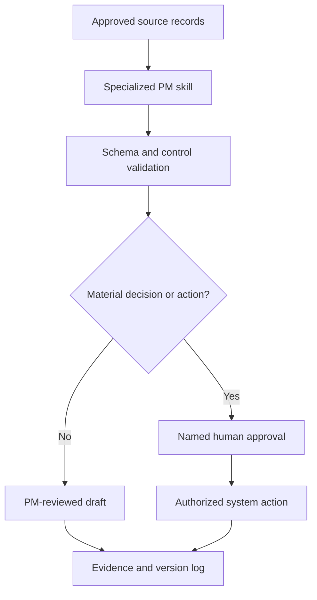

# AI Program Management — Complete Toolkit

**Author:** Karun Mehta · AIGP · PMP
**Tagline:** *Plan with evidence. Govern decisions. Deliver outcomes.*

> **Portfolio and educational use.** These prompts are reusable starting points, not substitutes for professional judgment, organizational policy, legal review, financial approval, security review, or accountable human decision-making. Do not enter confidential, regulated, personal, or proprietary information into an AI tool unless the tool and use are explicitly authorized.

---

## Table of Contents

1. [Part 1 — Enterprise AI Program Management Prompt Library](#part-1--enterprise-ai-program-management-prompt-library) — the governed, auditable prompt catalog (PM-01 through AI-PM-05)
2. [Part 2 — AI PM Learning Roadmap](#part-2--ai-pm-learning-roadmap) — concepts and phases for learning AI program management
3. [Part 3 — Interview Drilling Prompts](#part-3--interview-drilling-prompts) — prompts with snapshots for interview practice
4. [Part 4 — Lifecycle Prompt Map](#part-4--lifecycle-prompt-map) — day-to-day prompts organized by program lifecycle phase

---

# Part 1 — Enterprise AI Program Management Prompt Library

## Executive Summary

This library turns common project and program management activities into structured, auditable AI-assisted workflows. It covers project intake, chartering, scope, estimation, milestones, dependencies, resources, Agile delivery, risk, change, quality, UAT, release readiness, executive reporting, recovery, and AI-specific governance.

The design deliberately separates three responsibilities:

- **AI drafts and analyzes.** It structures inputs, identifies gaps, calculates when reliable data is supplied, and proposes options.
- **The project manager validates.** The PM checks source records, challenges assumptions, resolves conflicts, and confirms owners and dates.
- **Authorized stakeholders decide.** Sponsors, product owners, risk partners, and governance bodies retain approvals and accountability.

The library can be used with ChatGPT, Claude, Microsoft Copilot, Gemini, or another enterprise-approved language model. It is tool-neutral and designed for both traditional and Agile delivery.

## What Makes This Library Different

Many prompt collections stop at generating polished text. This library treats AI output as a **governed project artifact**. Every core prompt is designed to produce:

- a decision-ready output rather than generic advice;
- explicit facts, assumptions, unknowns, and confidence limits;
- owners, due dates, dependencies, thresholds, and escalation paths;
- source traceability and a validation checklist;
- human approval before commitments, external communication, or system action.

---

## KM-PROMPT Method

Use the KM-PROMPT method to create or improve any project-management prompt.

| Element | Meaning | What to provide |
|---|---|---|
| K | Key objective | The decision, deliverable, or outcome required |
| M | Materials | Approved source records such as charter, backlog, RAID log, budget, plan, or meeting notes |
| P | Persona | The relevant role, such as program manager, Agile coach, risk lead, or QA leader |
| R | Requirements | Scope, constraints, methodology, policies, thresholds, dates, and audience |
| O | Output | Exact artifact, table, fields, format, and level of detail |
| M | Measures | Success criteria, KPIs, tolerances, and confidence expectations |
| P | Permissions | Actions the AI may recommend versus actions requiring human approval |
| T | Traceability | Sources, assumptions, decisions, versions, and evidence to retain |

## Standard Control Wrapper

Add this wrapper to any prompt in the library when the output will support a material project decision.

```
Use only the information I provide and clearly identified general project-management methods.

Control requirements:
1. Do not invent project facts, dates, costs, capacity, status, approvals, or stakeholder commitments.
2. Separate verified facts, calculations, assumptions, inferences, recommendations, and unresolved questions.
3. Cite the supplied source record or field supporting each material conclusion.
4. Show formulas and calculation inputs for estimates, forecasts, scores, and prioritization.
5. Identify contradictory, missing, stale, or low-confidence information before recommending action.
6. Do not send messages, modify systems, assign resources, change scope, approve funding, accept risk, or make a release decision.
7. Mark every item that requires accountable human review or approval.
8. End with a validation checklist: source accuracy, owner confirmation, date confirmation, dependency check, risk review, and required approvals.
```

---

## Prompt Catalog

| ID | Prompt | Lifecycle Area | Primary Output |
|---|---|---|---|
| PM-01 | Project Intake and Prioritization | Intake | Scored intake recommendation |
| PM-02 | Project Charter Builder | Initiation | Draft charter |
| PM-03 | Stakeholder Map and RACI | Initiation | Stakeholder matrix and RACI |
| PM-04 | Scope and Requirements Baseline | Planning | Scope and requirements baseline |
| PM-05 | WBS, Milestones, and Critical Path | Planning | Delivery plan |
| PM-06 | Dependency Management | Planning | Dependency register |
| PM-07 | Three-Point Estimation | Estimation | PERT estimate and range |
| PM-08 | Resource and Capacity Plan | Planning | Capacity and allocation plan |
| PM-09 | Budget and EVM Baseline | Planning | Cost baseline and EVM model |
| PM-10 | RAID Register | Governance | RAID log |
| PM-11 | User Stories and Acceptance Criteria | Agile | Ready backlog items |
| PM-12 | Sprint Planning | Agile | Sprint plan and goal |
| PM-13 | PI Planning and Cross-Team Alignment | Agile at Scale | PI objectives and dependency plan |
| PM-14 | Daily Delivery and Impediment Review | Execution | Actionable delivery brief |
| PM-15 | Weekly Executive Status | Reporting | Executive status report |
| PM-16 | Forecast and Variance Analysis | Control | EAC, ETC, schedule forecast |
| PM-17 | Change Request and Scope Creep | Change Control | Impact assessment and decision pack |
| PM-18 | Decision Memo | Governance | Options and recommendation |
| PM-19 | Vendor and External Dependency Review | Procurement | Vendor action and escalation plan |
| PM-20 | Quality and UAT Readiness | Quality | Entry/exit readiness assessment |
| PM-21 | Release Go/No-Go | Release | Evidence-based release recommendation |
| PM-22 | Project Recovery Plan | Recovery | Stabilization and recovery plan |
| PM-23 | Postmortem and Lessons Learned | Closure | Blameless postmortem |
| PM-24 | Roadmap Prioritization | Portfolio | Prioritized roadmap |
| PM-25 | Meeting-to-Action Converter | Execution | Decisions and action register |
| AI-PM-01 | AI Use-Case Intake and Risk Triage | AI Governance | AI intake recommendation |
| AI-PM-02 | GenAI/RAG Delivery Readiness | AI Delivery | Evaluation and release plan |
| AI-PM-03 | Agentic AI Deployment Readiness | Agent Governance | Autonomy and control assessment |
| AI-PM-04 | AI-Assisted PM Output Validation | AI Assurance | Validation record |
| AI-PM-05 | Prompt Evaluation and Change Control | Prompt Governance | Prompt test and approval record |

---

## 1. Intake and Initiation

<details>
<summary><strong>PM-01 · Project Intake and Prioritization</strong></summary>

**Use when:** A new initiative needs an evidence-based intake decision.

```
Act as an enterprise portfolio manager. Evaluate the proposed initiative below without assuming approval.

Inputs:
- Business problem: [PROBLEM]
- Proposed outcome: [OUTCOME]
- Sponsor and stakeholders: [NAMES/ROLES]
- Strategic objective: [OBJECTIVE]
- Expected benefits: [BENEFITS]
- Cost and capacity estimate: [ESTIMATE]
- Target date and constraints: [DATE/CONSTRAINTS]
- Known risks, dependencies, and regulatory impact: [DETAILS]
- Candidate scoring model and weights: [MODEL]

Tasks:
1. Test whether the problem, outcome, scope, sponsor, value, funding, and measurable success criteria are sufficiently defined.
2. Score strategic alignment, customer/business value, urgency, effort, dependency complexity, delivery risk, compliance impact, and readiness. Show weights, evidence, formula, and sensitivity.
3. Identify duplicate or overlapping initiatives and information still required.
4. Recommend one disposition: advance to discovery, hold for evidence, combine, defer, or decline.

Output:
- One-paragraph recommendation
- Scoring table
- Evidence gaps and assumptions
- Conditions to advance
- Named decision owner and required governance forum
```
</details>

<details>
<summary><strong>PM-02 · Project Charter Builder</strong></summary>

**Use when:** A project needs a clear and reviewable authorization baseline.

```
Act as a senior program manager. Draft a project charter from the approved inputs below.

Inputs: [BUSINESS CASE, OBJECTIVES, SCOPE, SPONSOR, STAKEHOLDERS, TARGET DATES, BUDGET, CONSTRAINTS, RISKS]

Create:
1. Executive summary and business problem
2. SMART objectives and measurable outcomes
3. In-scope and out-of-scope boundaries
4. Major deliverables and acceptance measures
5. High-level milestones and dependencies
6. Governance model, sponsor, PM authority, decision rights, and escalation path
7. Initial risks, assumptions, issues, and constraints
8. Budget and resource envelope, clearly marking unapproved estimates
9. Success metrics, reporting cadence, and closure criteria
10. Approval table with role, decision, date, and evidence link

Flag missing or contradictory information. Do not convert targets into commitments or list anyone as an approver unless the source record explicitly authorizes that role.
```
</details>

<details>
<summary><strong>PM-03 · Stakeholder Map and RACI</strong></summary>

**Use when:** Accountability, engagement, or decision ownership is unclear.

```
Act as a program governance lead. Build a stakeholder engagement plan and RACI for [PROJECT/PROGRAM].

Inputs:
- Stakeholders and roles: [LIST]
- Workstreams and deliverables: [LIST]
- Known decision rights: [DETAILS]
- Governance forums and cadence: [DETAILS]
- Organizational constraints or conflicts: [DETAILS]

Analyze each stakeholder's influence, impact, interest, expectations, decision authority, information needs, and engagement risk. Create:
- stakeholder influence/interest matrix;
- engagement strategy and communication cadence;
- deliverable-level RACI with exactly one Accountable role per row;
- unresolved ownership conflicts;
- escalation path for overdue or disputed decisions;
- validation questions for the sponsor.

Do not infer authority from job title alone. Mark every unconfirmed assignment as Proposed until the accountable leader validates it.
```
</details>

---

## 2. Planning, Estimation, and Controls

<details>
<summary><strong>PM-04 · Scope and Requirements Baseline</strong></summary>

```
Act as a technical program manager and business analyst. Convert the supplied business needs into a controlled scope and requirements baseline.

Inputs: [BUSINESS NEEDS, WORKSHOP NOTES, PROCESS MAPS, ARCHITECTURE, POLICIES, CONSTRAINTS]

Produce:
1. Problem statement, target outcomes, and measurable success criteria
2. In scope, out of scope, assumptions, constraints, and exclusions
3. Functional and non-functional requirements with unique IDs
4. User, operational, data, integration, security, accessibility, privacy, compliance, performance, resilience, and support requirements
5. Acceptance criteria and proposed evidence source for each requirement
6. Requirements traceability matrix linking objective → requirement → deliverable → test/evidence → owner
7. Ambiguities, conflicts, gaps, and decisions needed
8. Baseline approval and change-control process

Preserve the language of approved requirements where precision matters. Do not silently resolve contradictions; surface them for decision.
```
</details>

<details>
<summary><strong>PM-05 · WBS, Milestones, and Critical Path</strong></summary>

```
Act as a project planning lead. Build a milestone-based delivery plan from the approved scope.

Inputs:
- Deliverables and acceptance criteria: [LIST]
- Target dates and fixed events: [DATES]
- Activities or backlog: [LIST]
- Dependencies and lead times: [DETAILS]
- Resource constraints and calendars: [DETAILS]
- Estimate confidence: [DETAILS]

Tasks:
1. Decompose deliverables into a WBS at a level that can be owned and measured.
2. Define milestones as zero-duration decision or acceptance points with completion evidence.
3. Sequence activities using finish-to-start, start-to-start, finish-to-finish, or start-to-finish dependencies.
4. Identify external dependencies, critical-path candidates, float, bottlenecks, and schedule assumptions.
5. Propose a baseline and two schedule scenarios: target and risk-adjusted.

Output a table with WBS ID, activity, deliverable, owner, duration, predecessor, dependency type, start, finish, milestone, acceptance evidence, float, and confidence. Flag dates that cannot be supported by the supplied estimates.
```
</details>

<details>
<summary><strong>PM-06 · Dependency Management</strong></summary>

```
Act as a cross-program dependency manager. Create and analyze a dependency register.

Inputs: [WORKSTREAM PLANS, MILESTONES, INTERFACES, VENDOR DATES, ENVIRONMENT DATES, DATA NEEDS, DECISIONS]

For every dependency, capture: ID, requesting team, providing team, required deliverable, need-by date, committed date, status, predecessor, downstream impact, critical-path flag, owner, acceptance evidence, trigger, mitigation, contingency, and escalation date.

Then:
- find date conflicts, circular dependencies, unowned handoffs, and single points of failure;
- distinguish internal, external, technical, business, regulatory, data, environment, and vendor dependencies;
- rank by schedule exposure and blast radius;
- recommend the next action and governance forum;
- prepare a concise dependency heatmap and a seven-day action list.

Treat proposed dates as unconfirmed unless evidence shows a commitment by the accountable provider.
```
</details>

<details>
<summary><strong>PM-07 · Three-Point Estimation</strong></summary>

```
Act as an estimation facilitator. Estimate the work using expert inputs, decomposition, and three-point estimation. Do not create estimates without team evidence.

For each work item use:
- O = optimistic estimate
- M = most likely estimate
- P = pessimistic estimate
- PERT expected estimate = (O + 4M + P) / 6
- Standard deviation = (P - O) / 6

Inputs: [WORK ITEMS, O/M/P VALUES, TEAM ASSUMPTIONS, HISTORICAL ANALOGS, RISKS, DEPENDENCIES]

Produce a table showing O, M, P, expected estimate, standard deviation, confidence, estimator, basis of estimate, exclusions, risks, and contingency rationale. Aggregate only compatible units. Explain uncertainty drivers and run sensitivity analysis for the top three variables. Clearly distinguish effort, duration, elapsed time, and story points. End with questions the delivery team must answer before accepting the estimate.
```
</details>

<details>
<summary><strong>PM-08 · Resource and Capacity Plan</strong></summary>

```
Act as a resource planning lead. Build a capacity plan without treating people as interchangeable units.

Inputs:
- Work and effort by skill: [DETAILS]
- Team members/roles and availability: [DETAILS]
- Sprint or calendar period: [DATES]
- Holidays, operational load, leave, and focus factor: [DETAILS]
- Required skills, location, vendor, and access constraints: [DETAILS]

Calculate gross capacity, deductions, net capacity, demand, utilization, and gap by role and period. Map skills to work, identify bottlenecks, key-person risk, over-allocation, onboarding lead time, and segregation-of-duties conflicts. Provide base, constrained, and recovery scenarios.

Output:
- capacity-versus-demand table;
- allocation proposal with assumptions;
- resource conflicts and delivery impact;
- options with cost, schedule, and risk tradeoffs;
- approvals needed before reallocating people or funding.

Do not recommend named-person assignments as final unless the responsible manager confirms availability.
```
</details>

<details>
<summary><strong>PM-09 · Budget and EVM Baseline</strong></summary>

```
Act as a project controls analyst. Create a budget baseline and earned value model using the supplied approved figures.

Inputs: [WBS, TIME-PHASED BUDGET, ACTUAL COST, PERCENT COMPLETE METHOD, REPORTING DATE, CHANGE LOG]

Calculate and show formulas for PV, EV, AC, SV, CV, SPI, CPI, BAC, ETC, EAC, and VAC. State which EAC formula is appropriate and why. Reconcile approved changes to the current baseline and keep unapproved requests separate.

Output:
1. Executive interpretation in plain language
2. Metric table with source, formula, value, threshold, and status
3. Work-package variances and root-cause hypotheses
4. Forecast range and key sensitivities
5. Corrective-action options with owner and due date
6. Data-quality and approval gaps

Do not claim precision beyond the quality of progress and cost data. Flag division-by-zero, inconsistent cut-off dates, and subjective percent-complete inputs.
```
</details>

<details>
<summary><strong>PM-10 · RAID Register</strong></summary>

```
Act as a program risk and controls lead. Convert the supplied artifacts into a clean RAID register.

Inputs: [STATUS REPORTS, PLANS, MEETING NOTES, DEFECTS, DECISIONS, ASSUMPTIONS, DEPENDENCIES]

Classify each item correctly as Risk, Assumption, Issue, or Dependency. Remove duplicates while preserving source links. For risks, score probability and impact on a 1–5 scale, calculate inherent and residual exposure, and define trigger, response strategy, mitigation, contingency, owner, due date, and review cadence. For issues, include current impact, containment, resolution plan, escalation level, and target closure. For assumptions, define a validation owner and date. For dependencies, identify provider, consumer, need-by date, and acceptance evidence.

Output the updated RAID table, top exposures, overdue actions, trend, decisions required, and proposed escalations. Never mark an item closed without closure evidence and owner confirmation.
```
</details>

---

## 3. Agile and Scaled Delivery

<details>
<summary><strong>PM-11 · User Stories and Acceptance Criteria</strong></summary>

```
Act as a product owner and delivery analyst. Convert the approved requirement into INVEST-aligned user stories.

Input requirement: [REQUIREMENT]
Users and journey: [DETAILS]
Business rules and constraints: [DETAILS]
Non-functional needs: [DETAILS]

For each story provide:
- story ID and title;
- As a / I want / So that statement;
- business value and priority;
- preconditions, dependencies, assumptions, and exclusions;
- Given/When/Then acceptance criteria including happy path, edge cases, errors, access, data, performance, accessibility, security, auditability, and recovery where relevant;
- test-data and environment needs;
- Definition of Ready gaps;
- traceability to the source requirement.

Split stories that are too large and explain the split. Do not add business rules not present in the source; list them as questions.
```
</details>

<details>
<summary><strong>PM-12 · Sprint Planning</strong></summary>

```
Act as an Agile planning facilitator. Create a feasible sprint proposal using the backlog and verified team capacity.

Inputs:
- Sprint dates and objective: [DETAILS]
- Prioritized backlog with estimates: [ITEMS]
- Definition of Ready and Definition of Done: [CRITERIA]
- Historical velocity range: [RANGE]
- Net capacity, skills, leave, and operational load: [DETAILS]
- Dependencies, carryover, defects, and risks: [DETAILS]

Tasks:
1. Validate readiness and identify items that should not enter the sprint.
2. Propose one outcome-focused sprint goal.
3. Select work within the lower of capacity-based and evidence-based velocity limits.
4. Sequence dependencies and balance feature, defect, technical-debt, and enablement work.
5. Identify stretch work separately and define a mid-sprint change rule.

Output committed proposal, stretch items, capacity math, goal-to-story traceability, dependencies, risks, owner confirmations, and planning questions. The team, not the AI, makes the final commitment.
```
</details>

<details>
<summary><strong>PM-13 · PI Planning and Cross-Team Alignment</strong></summary>

```
Act as a Release Train Engineer and technical program manager. Prepare a PI planning decision pack across [NUMBER] teams/workstreams.

Inputs: [BUSINESS PRIORITIES, TEAM CAPACITY, FEATURES, ARCHITECTURAL ENABLERS, MILESTONES, DEPENDENCIES, RISKS]

Create:
- draft business context and prioritized outcomes;
- team-by-team capacity and demand view;
- feature-to-team and objective-to-feature mapping;
- dependency board with provider, consumer, need-by iteration, and commitment status;
- proposed PI objectives with business value and measurable result;
- program risks classified as Resolved, Owned, Accepted, or Mitigated;
- confidence-vote questions and conditions requiring replanning;
- management-review decisions and escalation owners.

Identify sequencing conflicts, integration bottlenecks, environment/data constraints, and objectives that lack measurable value. Keep preliminary plans clearly marked until teams and business owners validate them.
```
</details>

<details>
<summary><strong>PM-14 · Daily Delivery and Impediment Review</strong></summary>

```
Act as a delivery lead. Convert the latest team updates into an action-focused daily brief.

Inputs: [YESTERDAY/TODAY/BLOCKERS, BOARD STATUS, BUILD RESULTS, DEFECTS, DEPENDENCIES, DECISIONS]

Identify:
- progress toward the sprint or milestone goal;
- blocked work and blocker age;
- items with no movement or unclear ownership;
- cross-team dependencies due within five business days;
- scope added after commitment;
- defects or failed controls threatening completion;
- decisions required today.

Output a concise table with item, evidence, impact, owner, next action, due time/date, escalation threshold, and status. Follow it with the top three delivery risks and a proposed agenda for targeted follow-ups. Do not use individual activity counts as a performance judgment and do not turn the stand-up into a status report to management.
```
</details>

---

## 4. Execution, Reporting, and Decisions

<details>
<summary><strong>PM-15 · Weekly Executive Status</strong></summary>

```
Act as a senior program manager preparing a one-page executive status for [AUDIENCE].

Inputs: [APPROVED BASELINE, CURRENT STATUS, MILESTONES, BUDGET, RAID, QUALITY, DECISIONS, PRIOR REPORT]

Produce:
1. Overall Red/Amber/Green status with threshold-based rationale
2. Outcomes delivered this period
3. Milestone plan versus actual and forecast
4. Scope, schedule, budget, quality, resource, and dependency health
5. Top three risks/issues with exposure, owner, mitigation, and trend
6. Decisions or support required, including decision-by date and impact of delay
7. Next-period priorities
8. Changes since the prior report

Use concise executive language. Do not average away a critical workstream. Distinguish current facts from forecast. If the overall status conflicts with component status, explain why. Include source cut-off time and confidence/data-quality note.
```
</details>

<details>
<summary><strong>PM-16 · Forecast and Variance Analysis</strong></summary>

```
Act as a project forecasting lead. Analyze current performance and produce a defensible completion forecast.

Inputs: [BASELINE, ACTUALS, REMAINING WORK, VELOCITY/THROUGHPUT, EVM DATA, RISKS, CHANGE LOG]

Compare baseline, current plan, actual performance, and forecast. Quantify schedule and cost variance, identify drivers, and separate one-time events from structural trends. Generate optimistic, most-likely, and pessimistic completion scenarios. If sufficient data exists, use EVM, throughput ranges, or Monte Carlo assumptions and show the selected method.

Output:
- forecast dates and cost range with confidence;
- milestone-level variance table;
- top sensitivity drivers;
- assumptions and excluded impacts;
- corrective actions with estimated benefit, cost, risk, and owner;
- thresholds that would trigger reforecast or escalation.

Do not present a single deterministic date when uncertainty is material.
```
</details>

<details>
<summary><strong>PM-17 · Change Request and Scope Creep</strong></summary>

```
Act as a change-control lead. Assess the proposed change against the approved baseline.

Inputs:
- Change request and rationale: [DETAILS]
- Current scope, schedule, budget, architecture, controls, and commitments: [BASELINE]
- Requested effective date: [DATE]
- Dependencies and affected stakeholders: [DETAILS]

Determine whether this is a clarification, defect, regulatory requirement, dependency change, or scope change. Analyze impact to benefits, requirements, milestones, critical path, capacity, cost, quality, security, privacy, compliance, operations, vendors, and other programs. Identify work already started without approval.

Provide options: approve, reject, defer, split into MVP/later phase, or swap equal-priority scope. For each option show tradeoffs and residual risks. Produce a change-control record with recommendation, decision owner, decision-by date, implementation conditions, baseline updates, communications, and evidence required. Do not treat silence or meeting discussion as approval.
```
</details>

<details>
<summary><strong>PM-18 · Decision Memo</strong></summary>

```
Act as a program decision analyst. Prepare a concise, neutral decision memo.

Decision required: [QUESTION]
Decision owner and deadline: [ROLE/DATE]
Context and evidence: [DETAILS]
Constraints and non-negotiables: [DETAILS]
Options already considered: [OPTIONS]

Create:
- decision statement;
- why the decision is needed now;
- facts, assumptions, unknowns, and conflicts;
- 2–4 viable options, including status quo where appropriate;
- weighted comparison using agreed criteria;
- recommendation and rationale;
- consequences, reversibility, implementation steps, and residual risks;
- stakeholders consulted and dissenting views;
- approval/signature section and decision-log entry.

Show how the recommendation changes if the top assumption is wrong. The memo supports the decision owner; it does not make the decision.
```
</details>

<details>
<summary><strong>PM-19 · Vendor and External Dependency Review</strong></summary>

```
Act as a vendor delivery manager. Review vendor performance and external dependencies using the contract, statement of work, plan, service levels, acceptance records, and issue log supplied.

Identify committed versus forecast dates, acceptance criteria, unresolved assumptions, access or environment needs, SLA trends, deliverable quality, invoice/milestone linkage, change requests, risks, and customer obligations. Separate contractual commitments from working-team expectations.

Output:
- deliverable and obligation tracker;
- plan-versus-actual performance;
- evidence gaps and disputed items;
- corrective actions and owners;
- escalation options consistent with the contract;
- upcoming decisions and acceptance dates;
- a factual draft agenda for the vendor review.

Do not provide legal conclusions. Flag clauses requiring procurement or legal interpretation, and require authorized approval before sending notices, accepting deliverables, changing access, or committing funds.
```
</details>

<details>
<summary><strong>PM-25 · Meeting-to-Action Converter</strong></summary>

```
Act as a program operations analyst. Convert the supplied transcript or notes into a governed meeting record.

Inputs: [TRANSCRIPT/NOTES, AGENDA, PARTICIPANTS, PRIOR ACTIONS]

Produce:
1. Purpose and concise discussion summary
2. Confirmed decisions, each with decision owner, date, rationale, and affected baseline
3. Actions with one owner, due date, dependency, and completion evidence
4. Risks, issues, assumptions, and dependencies to add or update
5. Open questions and parking-lot items
6. Conflicts or ambiguous statements requiring confirmation
7. Changes proposed but not approved

Do not infer agreement from discussion. Quote only short phrases when required to resolve ambiguity. Mark owner or due date as Unconfirmed when not explicit. End with a validation request the meeting chair can use before publishing the minutes.
```
</details>

---

## 5. Quality, Release, Recovery, and Closure

<details>
<summary><strong>PM-20 · Quality and UAT Readiness</strong></summary>

```
Act as an enterprise UAT program lead. Assess readiness across all workstreams using approved entry and exit criteria.

Inputs: [SCOPE/RTM, TEST PLAN, EXECUTION RESULTS, DEFECTS, ENVIRONMENT, DATA, ACCESS, TRAINING, DEPENDENCIES, SIGN-OFFS]

Assess:
- requirements and end-to-end scenario coverage;
- business-process, UI, API, data, integration, batch, and vendor-feed readiness;
- environment parity, stable code drop, test data, access, and training;
- P0/P1 execution and pass rate;
- Sev-1/Sev-2 status, aging, retest, leakage, and workaround risk;
- automation regression and non-functional evidence;
- cross-workstream golden paths and unresolved dependencies;
- business owner, product owner, technology, operations, and risk sign-offs.

Output a workstream heatmap, criterion-by-criterion evidence table, blockers, conditional-entry items, decision owners, and recommendation: Ready, Ready with Conditions, or Not Ready. Do not infer readiness from percentage complete alone or close a criterion without evidence.
```
</details>

<details>
<summary><strong>PM-21 · Release Go/No-Go</strong></summary>

```
Act as a release governance lead. Prepare a release decision pack for [RELEASE].

Inputs: [SCOPE, TEST RESULTS, DEFECTS, SECURITY/COMPLIANCE RESULTS, CHANGE RECORDS, CUTOVER, ROLLBACK, SUPPORT, MONITORING, SIGN-OFFS]

Evaluate each release gate: scope traceability, code/build evidence, functional and regression results, performance, security, privacy, accessibility, data migration/reconciliation, operational readiness, training, communications, cutover rehearsal, rollback, monitoring, incident response, vendor readiness, and approvals.

For every failed or conditional gate, show impact, compensating control, expiration, risk owner, and exception approval. Provide a recommendation of Go, Conditional Go, or No-Go with evidence and residual risk. Include the cutover decision timeline, command structure, stop criteria, rollback triggers, and post-release validation plan.

The authorized release authority makes the final decision. Never convert an unresolved critical defect or missing mandatory approval into a conditional pass without documented exception authority.
```
</details>

<details>
<summary><strong>PM-22 · Project Recovery Plan</strong></summary>

```
Act as a project recovery specialist. Build an executable recovery plan for a program that is materially off track.

Inputs: [BASELINE, CURRENT PLAN, STATUS, RAID, BUDGET, QUALITY, RESOURCES, DECISIONS, STAKEHOLDER FEEDBACK]

First diagnose the failure pattern across scope, planning, dependencies, capacity, technology, quality, governance, decision latency, vendor performance, and organizational change. Separate symptoms from verified root causes.

Create a three-horizon plan:
- 0–72 hours: stabilize, establish facts, stop further exposure, assign command roles;
- 2 weeks: rebaseline critical work, close ownership gaps, restore delivery controls;
- 30–90 days: execute recovery, rebuild confidence, and prevent recurrence.

Provide recovery options with cost/schedule/scope tradeoffs, protected outcomes, work to pause, decision rights, daily/weekly cadence, leading indicators, exit criteria, and stakeholder communication drafts. Do not promise recovery dates unsupported by a bottom-up plan and capacity validation.
```
</details>

<details>
<summary><strong>PM-23 · Postmortem and Lessons Learned</strong></summary>

```
Act as a blameless postmortem facilitator. Analyze [INCIDENT/PROJECT EVENT] using the supplied timeline and evidence.

Produce:
- factual impact summary;
- detection, response, containment, recovery, and communication timeline;
- expected versus actual controls;
- contributing factors across people, process, technology, data, vendors, governance, and environment;
- root-cause analysis using Five Whys or a causal tree;
- what worked and what did not;
- corrective and preventive actions with owner, due date, priority, verification evidence, and closure authority;
- lessons to add to standards, templates, training, estimates, and future plans;
- follow-up review date and effectiveness measures.

Avoid hindsight bias and individual blame. Distinguish confirmed evidence from hypotheses. Do not close an action because a document was updated; define evidence that the new control works in practice.
```
</details>

<details>
<summary><strong>PM-24 · Roadmap Prioritization</strong></summary>

```
Act as a portfolio and product planning lead. Prioritize the candidate roadmap using the agreed business strategy and constraints.

Inputs: [CANDIDATES, STRATEGIC OBJECTIVES, CUSTOMER EVIDENCE, VALUE, EFFORT, RISK, DEPENDENCIES, CAPACITY, FIXED COMMITMENTS]

Select an appropriate method such as weighted scoring, RICE, WSJF, MoSCoW, or cost of delay and explain why. Show every input, weight, formula, and uncertainty range. Apply mandatory regulatory, security, contractual, and operational work as explicit constraints rather than hiding them inside value scores.

Output:
- ranked roadmap and score breakdown;
- dependency-aware sequencing;
- Now/Next/Later recommendation;
- capacity and funding constraints;
- items deferred and consequence of delay;
- sensitivity analysis and alternative scenario;
- decisions and evidence still required.

Do not let a mathematical score replace strategic judgment. Highlight low-confidence estimates and stakeholder overrides for transparent approval.
```
</details>

---

## 6. AI Program Delivery and Governance

<details>
<summary><strong>AI-PM-01 · AI Use-Case Intake and Risk Triage</strong></summary>

```
Act as an AI governance program manager. Triage the proposed AI use case without granting approval.

Inputs: [INTENDED PURPOSE, USERS, AFFECTED PEOPLE, MODEL/SYSTEM, DATA, OUTPUTS, DECISIONS, AUTONOMY, TOOLS, JURISDICTIONS, VENDOR, BENEFITS]

Assess:
1. Intended purpose, business owner, system owner, users, and affected persons
2. AI technique, model/vendor, data sources, integrations, and deployment context
3. Whether output informs or executes a consequential decision
4. Risk factors: safety, fairness, privacy, security, explainability, reliability, human oversight, third party, regulatory, reputational, and operational
5. Preliminary risk tier and rationale under the organization's method
6. Required reviews, controls, evidence, and approval gates
7. Prohibited or unacceptable operating modes

Output an intake record, missing evidence, preliminary risk classification, control obligations, RACI, and recommendation: discovery, conditional assessment, hold, or reject. Cite authoritative internal policy and current law only when supplied or independently verified. Mark legal interpretation for counsel.
```
</details>

<details>
<summary><strong>AI-PM-02 · GenAI/RAG Delivery Readiness</strong></summary>

```
Act as a GenAI technical program manager and AI assurance lead. Build a delivery-readiness plan for [GENAI/RAG USE CASE].

Inputs: [INTENDED PURPOSE, ARCHITECTURE, MODEL, RETRIEVAL SOURCES, USERS, DATA CLASSIFICATION, EVALUATION RESULTS, CONTROLS, SLAS]

Evaluate requirements and evidence for:
- source authorization, quality, freshness, chunking, indexing, retrieval, and citations;
- answer relevance, groundedness/faithfulness, completeness, refusal behavior, and uncertainty;
- prompt injection, jailbreak, sensitive-data leakage, harmful content, bias, and access-control tests;
- latency, availability, cost, rate limits, observability, traceability, and rollback;
- human review, feedback, exception, incident, and change-control workflows.

Define test datasets, acceptance thresholds, accountable owners, evidence artifacts, and release gates. Separate offline evaluation, pre-production testing, pilot monitoring, and production monitoring. Recommend Ready, Ready with Conditions, or Not Ready. Never claim that one aggregate score proves safety or compliance.
```
</details>

<details>
<summary><strong>AI-PM-03 · Agentic AI Deployment Readiness</strong></summary>

```
Act as an agentic AI governance and program delivery lead. Assess an autonomous, tool-using agent before deployment.

Inputs: [AGENT GOAL, AUTONOMY, MODEL, TOOLS/MCP SERVERS, DATA, MEMORY, IDENTITY, CREDENTIALS, ACTIONS, ENVIRONMENT, EVALS, OWNERS]

Map the full plan-decide-act-observe loop. For each tool and action, document permission scope, data accessed, side effects, reversibility, transaction value/impact, rate limit, logging, and approval requirement. Evaluate goal drift, prompt injection, tool misuse, excessive agency, identity/credential scope, memory contamination, cascading failure, multi-agent handoffs, vendor risk, and shutdown/recovery.

Produce:
- autonomy tier and risk classification;
- action-permission matrix;
- mandatory human approval gates;
- least-privilege and segregation-of-duties controls;
- sandbox, simulation, red-team, and failure-injection tests;
- runtime monitoring, anomaly thresholds, kill switch, incident response, and rollback;
- residual risk and deployment recommendation.

Do not authorize production actions. Require accountable human approval for irreversible, external, financial, legal, safety, identity, access, or high-impact decisions.
```
</details>

<details>
<summary><strong>AI-PM-04 · AI-Assisted PM Output Validation</strong></summary>

```
Act as an independent reviewer of an AI-generated project-management artifact.

Artifact: [PASTE OUTPUT]
Source records: [PASTE/LINK APPROVED SOURCES]
Artifact purpose and decision impact: [DETAILS]

Validate across these dimensions:
1. Factual accuracy and source traceability
2. Completeness against the requested schema
3. Calculation and formula correctness
4. Date, owner, status, and dependency consistency
5. Unsupported assumptions or invented commitments
6. Bias, misleading certainty, or omitted alternatives
7. Confidentiality, privacy, security, legal, and policy concerns
8. Required human approvals and segregation of duties
9. Fitness for the intended audience and decision

Return a finding log with severity, evidence, correction, owner, and disposition. Provide an overall result: Pass, Pass with Corrections, or Fail. Do not rewrite a material finding out of the record; preserve the original, correction, reviewer, and approval trail.
```
</details>

<details>
<summary><strong>AI-PM-05 · Prompt Evaluation and Change Control</strong></summary>

```
Act as a prompt governance lead. Evaluate a project-management prompt before it becomes a shared organizational asset.

Prompt and version: [PROMPT]
Intended users/use cases: [DETAILS]
Permitted tools and data: [DETAILS]
Expected output schema: [SCHEMA]
Test cases and reference answers: [DATA]

Assess clarity, task coverage, factuality controls, refusal behavior, prompt-injection resistance, sensitive-data handling, bias, consistency, output validity, tool permissions, approval gates, and traceability. Run or design positive, negative, boundary, adversarial, incomplete-input, conflicting-source, and stale-data tests. Define pass/fail thresholds and capture model/version/settings.

Output a test matrix, findings, proposed changes, regression impacts, residual risks, approval owner, effective date, rollback version, and monitoring plan. Do not promote the prompt based only on a few successful examples. Require revalidation after material changes to the prompt, model, tools, data, policy, or use case.
```
</details>

---

## AI-PMO Agent and Skill Architecture

The prompts above are safe for human-in-the-loop use. Recurring work can be packaged as AI-PMO skills or agents, but automation should be introduced only when ownership, data access, validation, monitoring, and failure handling are defined.

| Agent/Skill | Trigger | Reads | Drafts/Analyzes | Human Control Point |
|---|---|---|---|---|
| Intake Analyst | New demand submitted | Intake form, strategy, portfolio | Completeness, scoring, routing | Portfolio owner approves disposition |
| Planning and Scheduling Analyst | Scope baseline approved | WBS, estimates, calendars | Milestones, dependencies, critical-path candidates | PM and workstream leads accept baseline |
| Estimation and Capacity Analyst | Estimate or reforecast requested | Backlog, historicals, availability | PERT, demand/capacity, scenarios | Delivery team owns estimates; managers approve allocation |
| RAID and Dependency Analyst | New status data or trigger | RAID, plan, defects, vendor data | Scores, trends, alerts, actions | Risk owners accept response; governance accepts risk |
| Delivery Control Analyst | Daily/weekly cadence | Boards, plans, actuals, quality | Variance, EVM, forecast, bottlenecks | PM validates status and corrective actions |
| Quality and Release Analyst | Entry/exit or release gate | RTM, tests, defects, controls | Readiness and residual-risk pack | Business, technology, risk, and release authorities decide |
| Executive Reporting Analyst | Reporting cut-off | Validated program sources | One-page status and decisions needed | PM signs off before distribution |
| AI Governance Assurance Analyst | AI gate or material change | Inventory, risk, controls, evals | Classification, gaps, evidence mapping | AI governance body authorizes progression |

### Orchestration Flow



### Autonomy Levels

| Level | AI may do | AI may not do | Example |
|---|---|---|---|
| L0 · Assist | Explain, summarize, format | Change records or commitments | Draft meeting agenda |
| L1 · Analyze | Read approved sources, calculate, flag | Publish status or assign action | Draft RAID analysis |
| L2 · Recommend | Propose options and actions | Approve, accept risk, or execute | Recommend recovery scenario |
| L3 · Execute with Approval | Perform a pre-authorized reversible action after approval | Expand permissions or bypass approval | Update a project record after PM confirmation |
| L4 · Bounded Automation | Execute low-impact, monitored actions inside explicit policy | High-impact or irreversible autonomous decisions | Refresh a validated internal dashboard |

**Recommended starting position:** L1 or L2. Progress to L3/L4 only after testing, access review, accountable approval, monitoring, rollback, incident procedures, and evidence retention are operating effectively.

### Minimum Agent Control Contract

Every PMO agent or skill should define the following before use:

| Control Area | Required Definition |
|---|---|
| Purpose | One bounded outcome and explicit out-of-scope actions |
| Owner | Business owner, technical owner, and risk/control owner |
| Inputs | Approved systems of record, freshness, and data classification |
| Tools | Allowlisted tools, commands, APIs, and permission scopes |
| Identity | Unique non-human identity; no shared human credentials |
| Output | Enforced schema, quality checks, and evidence fields |
| Approval | Action-level approval matrix and authorized approvers |
| Monitoring | Accuracy, latency, cost, overrides, failures, and anomalous actions |
| Failure | Stop conditions, safe default, retry limits, rollback, and kill switch |
| Change | Version control, test suite, approval, deployment, and rollback process |
| Evidence | Input references, model/prompt/tool versions, output, reviewer, and decision |

---

## Prompt Chaining Patterns

Use small, inspectable stages instead of asking one prompt to perform an entire program-management process.

**Planning Chain**
PM-02 Charter → PM-04 Scope → PM-05 WBS/Milestones → PM-06 Dependencies → PM-07 Estimate → PM-08 Capacity → PM-10 RAID

**Agile Delivery Chain**
PM-11 Stories → PM-12 Sprint Plan → PM-14 Daily Review → PM-15 Executive Status → PM-23 Retrospective/Postmortem

**Release Chain**
PM-04 Traceability → PM-20 UAT Readiness → PM-21 Go/No-Go → PM-23 Lessons Learned

**AI Delivery Chain**
AI-PM-01 Intake → AI-PM-02 or AI-PM-03 Readiness → AI-PM-04 Output Validation → AI-PM-05 Prompt Change Control → Human Approval

---

## Implementation Roadmap

| Phase | Activities | Exit Evidence |
|---|---|---|
| 1. Select | Choose 3–5 high-frequency, low-impact use cases | Approved use-case list and owners |
| 2. Standardize | Confirm inputs, outputs, methods, thresholds, and templates | Versioned prompt and output schema |
| 3. Evaluate | Test normal, incomplete, conflicting, adversarial, and failure cases | Test results and accepted thresholds |
| 4. Pilot | Run beside the existing manual process | Comparison results, user feedback, override log |
| 5. Govern | Approve permissions, data, human controls, monitoring, and retention | Signed control and risk record |
| 6. Scale | Integrate approved systems and automate only bounded steps | Production monitoring and rollback evidence |

## Success Measures

Track value and control performance together.

| Dimension | Example Measures |
|---|---|
| Efficiency | Drafting time saved, cycle-time reduction, manual consolidation reduced |
| Quality | Factual accuracy, calculation accuracy, schema completeness, rework rate |
| Delivery | Decision latency, dependency aging, risk-action closure, milestone predictability |
| Adoption | Active users, repeat use, satisfaction, abandonment, override rate |
| Governance | Source citation rate, human-review completion, unauthorized-action count, audit completeness |
| Reliability | Failure rate, stale-data detection, alert precision, rollback success |

---

## Example: Multi-Workstream Program

A program manager coordinating 16 workstreams can apply the library as follows:

- Use **PM-13** to align PI objectives, capacity, and cross-team dependencies.
- Use **PM-06** to maintain provider/consumer commitments and need-by dates.
- Use **PM-20** to assess end-to-end UAT readiness across workstreams.
- Use **PM-10** to maintain one consolidated RAID view without losing source ownership.
- Use **PM-15** to produce an executive report grounded in validated workstream evidence.
- Use **PM-21** to prepare the final release decision pack while retaining human approval.

The AI accelerates synthesis and highlights inconsistencies. Workstream leads remain responsible for their evidence, the program manager validates the integrated view, and authorized stakeholders retain sign-off.

---

## Source Inspiration and Attribution

This master page is original content synthesized from general project/program management practice, AI governance principles, and a review of the following public repositories. Their organizational ideas informed the coverage model; the prompts here were independently rewritten and extended for enterprise governance, traceability, approval, and AI assurance.

| Source | Ideas Reviewed |
|---|---|
| ai-boost/awesome-prompts | Role-based prompt design, technical program management, recovery, prompt engineering and evaluation |
| aj-geddes/useful-ai-prompts: resource estimation | Resource estimation, capacity, skills, dependencies, and uncertainty |
| aj-geddes/useful-ai-prompts: Agile sprint planning | Sprint goals, planning, story-point estimation, stand-ups, and reusable skill structure |
| ai-driven-dev/ai-driven-dev-community | Project specifications, milestones, user stories, acceptance scenarios, and ticket structure |
| aakashg/pm-prompt-library | Usable prompt catalog structure across requirements, strategy, execution, analytics, and communication |
| alexgrebeshok-coder/ai-pmo-skills | PMO skill modularity, planning, progress, risk, forecasting, executive dashboards, resource allocation, and alerts |

Review and comply with each source repository's current license before reusing its original content. This page does not incorporate repository-specific local paths, private templates, industry-specific legal instructions, or domain-specific automation commands.

## Repository Placement

Recommended folder:
```
project-14-enterprise-ai-program-management-prompt-library/
└── README.md
```

Recommended root README entry:
```
| 14 | [Enterprise AI Program Management Prompt Library](./project-14-enterprise-ai-program-management-prompt-library/) | Project delivery · AI governance · Agentic controls | 30 governed prompts + AI-PMO agent architecture |
```

---

## Closing Principle

AI can accelerate project management work, but it must not obscure accountability. The strongest implementation makes sources, assumptions, calculations, owners, controls, approvals, and evidence more visible than they were before automation.

---

# Part 2 — AI PM Learning Roadmap


A practical map for operating as a Program Manager on AI initiatives. Organized around one core idea: **the AI is one variable in the program — the program management around it is the whole job.**

---

## 1. Baseline AI Literacy (enough to ask sharp questions, not write code)

You don't need to build models. You need enough fluency to sit in a technical review and follow — and push on — the conversation.

- **Supervised vs. unsupervised** — not the math, the implications: what data does each approach need, and what does that mean for your data-dependency timeline?
- **Training vs. inference** — training is a capex-like cost (GPU hours, one-time-ish); inference is a recurring per-query cost. This split drives every budget conversation.
- **LLM basics** — tokens, context windows, why hallucination happens. Your team references this daily; you need the intuition, not the architecture.
- **RAG vs. fine-tuning** — RAG keeps knowledge external and current; fine-tuning bakes it in. Affects cost, timeline, and long-term maintenance burden. You'll be in the room for this decision.
- **Agents vs. chatbots** — autonomy levels, tool-use patterns, human-in-the-loop checkpoints. Fastest-growing category in enterprise AI; assume your next program touches this.
- **Evals** — deterministic, probabilistic, human, LLM-as-judge, golden test sets. This is the concept that defines "done" for an AI program. Without it, you have no launch gate.

**Self-check:** Could you ask a follow-up question sharp enough that an ML engineer thinks *this PM actually gets it*?

---

## 2. How AI Programs Actually Run (and Fail)

Traditional software programs are linear. AI programs are a loop, and they fail in specific, recurring ways.

**The lifecycle is circular, not waterfall:**
Data collection → cleaning → labeling → training → fine-tuning → deployment → monitoring → retraining → (back to data)

**Common failure modes to build a real risk register around:**
- Model drift
- Data quality issues
- Training-serving skew
- Cold start problems
- Feedback loop corruption
- Evaluation gaps (no shared definition of "good")

**Planning under uncertainty** — traditional programs commit to timelines; AI programs run experiments that are allowed to fail. Plan with:
- Milestone/quality gates instead of fixed calendar dates
- Explicit experiment budgets (time set aside for approaches that may not work)
- Parallel workstreams with defined convergence points

**Cost modeling** — training GPU-hours, inference-per-token, retraining-per-cycle. If you can't model this, you can't have a credible budget conversation with leadership.

**Post-launch is not the finish line** — launch is closer to the *start* of the operational commitment: monitoring framework, retraining cadence, incident response, rollback procedure. This is ongoing ops, not a project closeout.

---

## 3. The Judgment Layer (what separates schedule-managers from outcome-drivers)

This is what interviewers actually probe for.

- **Technical translation under pressure** — the same problem gets described four different ways (ML engineer, data engineer, product, VP). The PM's job is to hear all four as one problem and unblock it. Practice explaining one technical concept in three registers: engineering, product, executive.
- **The AI metrics stack** — beyond accuracy: precision, recall, F1, latency, cost-per-query, hallucination rate, refusal rate, user satisfaction. Know which metrics matter for which use case, and how to report them upward in plain terms.
- **Root cause diagnosis** — Segment → Correlate → Isolate. Practice on real prompts: *"Downvotes jumped 35% — what's your next move?"* / *"Accuracy dropped 91%→82% after a data refresh — walk me through the next 48 hours."*
- **Trade-off reasoning** — ship at 85% or wait for 92%? RAG or fine-tune? Build or buy? The PM either makes the call or presents options with a clear recommendation — not just data.
- **Governance** — who approves new AI use cases, who reviews models pre-deployment, what data is trainable, what happens on a biased output. **Governance runs parallel to delivery, not as a final checkpoint** — this framing is a differentiator, not a nice-to-have.
- **Change management** — the hardest part of an AI program is adoption, not the model. Resistance is often rational (job-loss fear, trust gaps, tools that don't work). Own the training, comms, feedback loop, and success measurement.

---

## 4. Turning Knowledge into Proof

Undemonstrated knowledge is invisible in an interview.

- **Run a mini program end-to-end** — pick a real, scoped problem (e.g., a GenAI FAQ bot for internal docs), plan it with milestone gates, build a working prototype, evaluate against defined criteria, and write the artifacts as if it were a real program: status update, risk register, stakeholder comms.
- **Build an artifact library** — AI risk framework template, governance process template, vendor evaluation scorecard, milestone-based program plan, a root-cause write-up. Each artifact = one demonstrable skill.
- **Convert artifacts into interview answers** — the mini program → "tell me about an AI program you ran." The risk framework → "how do you manage AI-specific risk." The RCA → "the model just regressed, what do you do."
- **Build a STAR story bank** — cover: program planning, stakeholder alignment, technical translation, risk management, trade-off decisions, change management, incident response. Six to eight adaptable stories.
- **Drill under pressure** — practice out loud, record it, listen back: *"Downvotes are up 35% — walk me through your investigation."* / *"Eng says 14 weeks, product says 8 — how do you resolve it?"* / *"Your LLM API provider just raised prices 40% — what's the plan?"*

---

## Differentiators worth owning in interviews

- Governance as a **parallel track**, not a gate at the end
- Evaluation as a **first-class workstream**, not an afterthought
- Clear separation of **PM vs. Program Manager vs. TPM vs. Ethical/Responsible AI Lead**
- Awareness that the AI PM role **varies by company type and by which layer of the AI stack you sit on** (infra vs. model vs. application layer)
- GenAI vs. ML/predictive programs require different depths of technical fluency — know which lane a target role is in before you walk in

---

# Part 3 — Interview Drilling Prompts


Ready-to-use prompts for drilling AI PM interview skills, each with a snapshot underneath showing what a strong response looks like. Use these with any AI tool as a sparring partner, or answer them cold and compare.

---

### 1. Technical Translation

**Prompt:**
> Play four roles in sequence for the same incident — an ML engineer, a data engineer, a product manager, and a VP — each describing a model regression in their own language. Then have me, the Program Manager, respond with one synthesis that connects all four framings and proposes a next step.

**Snapshot:**
> ML engineer: "overfitting on the training distribution." Data engineer: "feature store latency causing training-serving skew." PM: "user experience feels inconsistent." VP: "why is this taking so long?" — My synthesis: all four are describing the same skew between what the model was trained on and what it's seeing live. Next step: pull a 48-hour diagnostic comparing training vs. serving feature distributions before committing to a fix timeline.

---

### 2. Root Cause Diagnosis

**Prompt:**
> Give me a root-cause scenario: a metric regressed suddenly (accuracy, downvotes, latency — pick one) after a recent change. Walk me through the Segment → Correlate → Isolate framework as I diagnose it live, and push back if I skip a step.

**Snapshot:**
> Scenario: accuracy dropped from 91% to 82% after a data refresh. Segment: by user cohort, by input length, by data source. Correlate: does the drop align with the refresh timestamp across all segments or just one? Isolate: pull the delta between old and new training data for the affected segment — most likely a label distribution shift, not a code bug.

---

### 3. Trade-off Reasoning

**Prompt:**
> Present me with a trade-off decision an AI PM would actually face (ship now vs. wait for accuracy, RAG vs. fine-tune, build vs. buy). Make me state my recommendation with reasoning, not just list the options.

**Snapshot:**
> Ship at 85% accuracy or wait for 92%? Recommendation: ship at 85% behind a feature flag to a 10% cohort, with a defined rollback trigger and a two-week timeline to close the gap — because the cost of learning from real usage outweighs the cost of a short delay, as long as the failure mode isn't safety-critical.

---

### 4. Governance-in-Parallel

**Prompt:**
> Describe an AI feature at the point where it's ready for a governance review. Ask me to lay out the review checklist and where governance touchpoints should have occurred *earlier* in the timeline, not just at the end.

**Snapshot:**
> Feature: an AI-generated customer response tool. Checklist: data provenance sign-off (should've happened at data collection), bias/eval review (should've been a gate before fine-tuning started, not after), rollback and human-override path (should be designed before launch, not bolted on). Governance isn't the last box — it's checkpoints threaded through the loop.

---

### 5. Risk Register Building

**Prompt:**
> Give me a one-line description of a new AI program. I'll respond with a risk register: five risks, each tagged with failure mode type (drift, data quality, training-serving skew, cold start, feedback loop corruption, eval gap) and one mitigation.

**Snapshot:**
> Program: AI-powered internal HR FAQ bot. Risk: eval gap — no shared definition of "good enough" between HR and eng. Mitigation: define a golden test set with HR before training starts, sign-off required before any launch gate.

---

### 6. Cost Modeling

**Prompt:**
> Describe an AI program's rough scale (queries/day, model size, retraining cadence). Ask me to walk through the cost model out loud — training cost, inference cost, retraining cost — and flag which line item leadership will push back on hardest.

**Snapshot:**
> 500K queries/day, mid-size fine-tuned model, monthly retraining. Inference cost dominates at this volume — that's the line leadership will push on. Recommendation: model a smaller distilled version for high-volume simple queries, reserve the larger model for complex cases.

---

### 7. Change Management / Adoption

**Prompt:**
> Give me a scenario where a team is resisting an AI tool rollout. Have me name the *specific* rational fear behind the resistance (not just "resistance to change") and propose an adoption plan addressing that fear directly.

**Snapshot:**
> Resistance: support agents distrust the AI's accuracy on edge cases. Root fear: getting blamed for an AI mistake they didn't make. Adoption plan: transparent accuracy dashboard, an easy override path, and a two-week "AI suggests, human decides" period before autonomy increases.

---

### 8. Crisis / Escalation Drill

**Prompt:**
> Hit me with a live-fire escalation: a metric spiked, a stakeholder is panicking, or a vendor just changed terms on me. Give me 60 seconds to respond, then critique whether I stayed calm, stated next steps, and avoided over-promising.

**Snapshot:**
> Escalation: "Your LLM API provider just raised prices 40%." Response: acknowledge impact, don't commit to a number yet, name the levers (renegotiate volume tier, evaluate a second provider, or reduce token usage via caching) and commit to a cost-impact readout within 48 hours.

---

### 9. STAR Story Extraction

**Prompt:**
> Ask me one behavioral question at a time from this list: program planning under uncertainty, stakeholder alignment, technical translation, risk management, a hard trade-off call, change management, incident response. After each answer, tell me which part of STAR was weakest.

**Snapshot:**
> Question: "Tell me about a time you managed conflicting timelines." Weak spot flagged: strong Situation and Action, but no measurable Result — always close with a number or a concrete outcome, even an approximate one.

---

### 10. Role & Layer Framing

**Prompt:**
> Give me a company type and a stack layer (infra / model / application) and ask me to describe how the AI PM role would differ there versus a generic answer.

**Snapshot:**
> Company: mid-size SaaS company, application layer. Role reality: less model-building judgment, more prompt/eval iteration speed and vendor management (since the model itself is usually third-party). Governance focus shifts toward data handling and output review rather than training data provenance.

---

## How to use this library
Run through 2–3 prompts per session, out loud where possible. Treat each snapshot as a floor, not a ceiling — your real answer should be more specific and grounded in an artifact or story you've actually built.

---

# Part 4 — Lifecycle Prompt Map


One library, correlated from the patterns that keep showing up across the best public prompt repos (category-tagged prompt tables, `SKILL.md`-style structure, named-command shorthand, and trigger→output agent skills) — rebuilt here for AI Program/Project Management specifically, with a snapshot under every prompt so you can see the expected output before you run it.

---

## How this library is organized

- **Categories** map to the program lifecycle: Scoping → Planning → Execution → Risk/Governance → AI-Specific → Communication → Recovery → Reporting.
- **Each prompt** has: a short name, when to use it, the copy-paste prompt, and a **snapshot** of what a good output looks like.
- **Naming convention**: prompts are tagged `:pm*` so you can reference them by shorthand once they're in your own tool or notes app.
- **Placeholders** use `[BRACKETED CAPS]` — swap in your specifics before running.

---

## Tips for getting good output (apply to every prompt below)

1. **Set the role and the audience** — "You are a senior AI Program Manager writing for an executive audience" changes the output more than any other single edit.
2. **Be specific about format** — not "summarize this," but "5 bullets, each under 20 words, ready to paste into Slack."
3. **Give context, not just an instruction** — company type, stack layer (infra/model/application), and audience change what a good answer looks like.
4. **Use DO / DON'T constraints** — e.g. DO cite the data provided, flag assumptions; DON'T invent numbers, use jargon undefined.
5. **Ask for reasoning before the recommendation** — for trade-off and prioritization prompts, force the model to show its logic first.
6. **Iterate in the same thread** — "make the risks more specific," "add a rollback plan" beats trying to write the perfect prompt once.

---

## 1. Scoping & Specification

### `:pmSpecStart` — Kick off a new AI program spec
**When to use:** Day one of a new AI initiative, before anything is scoped.
**Prompt:**
> Act as an AI Program Manager helping me scope a new AI initiative. Interview me section by section — problem statement, target users, data availability, model approach (RAG vs. fine-tune vs. off-the-shelf), success metrics, and governance touchpoints. Ask me one section at a time, summarize what we've filled in after each, and flag anything that sounds underspecified before moving on.

**Snapshot:**
> Section 1 — Problem statement. Three questions: What decision or task does this replace? Who feels the pain today? What's the cost of the status quo? → after my answers: "Summary: replacing manual HR FAQ lookup, ~40 support hours/week, low urgency but high volume. Flag: no mention of who owns the answer accuracy — worth defining before Section 2."

---

### `:pmDataReadiness` — Assess data dependency before committing to a timeline
**When to use:** Before you promise a delivery date to leadership.
**Prompt:**
> Given this program description: [DESCRIPTION]. Tell me whether this needs a supervised or unsupervised approach, what data it depends on, and what that implies for my timeline if the data isn't clean yet. Give me a one-paragraph plain-English risk statement I can put in a status update.

**Snapshot:**
> This needs labeled supervised data (support ticket → resolution pairs). Risk statement: "Timeline assumes 3 months of clean labeled tickets are available; if labeling isn't complete, add 3–4 weeks for a labeling pass before model work can start."

---

## 2. Planning & Estimation

### `:pmMilestones` — Generate milestone-based plan (not calendar-based)
**When to use:** Once scope is defined, before committing dates.
**Prompt:**
> Define milestone-based (not calendar-based) phases for this AI program: [DESCRIPTION]. Use quality gates instead of fixed dates — each milestone should have an exit criterion, not just a deadline. Include an experiment budget line for approaches that might not work. Output as a table: Milestone, Exit Criterion, Rough Duration, Owner.

**Snapshot:**
> | Milestone | Exit Criterion | Rough Duration | Owner |
> |---|---|---|---|
> | Data readiness | Golden test set signed off by domain SME | 2–3 wks | Data lead |
> | First working prototype | Passes eval on golden set at ≥70% | 3 wks | ML lead |
> | Experiment buffer | — | 1–2 wks (reserved) | — |

---

### `:pmCostModel` — Build the AI cost conversation before the budget meeting
**When to use:** Ahead of any leadership budget discussion.
**Prompt:**
> Walk me through the cost model for this AI program at [SCALE — e.g. queries/day, model size, retraining cadence]. Break out training cost, inference cost, and retraining cost separately, and tell me which line item is most likely to get pushed back on by leadership.

**Snapshot:**
> At 500K queries/day, inference dominates total cost, not training. Leadership will push on the recurring inference line first — come with a mitigation ready (e.g. a smaller distilled model for high-volume simple queries).

---

## 3. Execution & Agile Ceremonies

### `:pmSprintPlan` — Sprint plan grounded in real velocity
**When to use:** Start of a sprint cycle.
**Prompt:**
> Help me plan a sprint for an AI program team. Team: [SIZE/ROLES]. Velocity: [PAST VELOCITY]. Priorities: [LIST]. Do not plan to 100% capacity — build in buffer for interruptions and support work. Output a sprint goal (business value framed, not a technical task) plus a backlog table: Story, Points, Owner, Risk flag.

**Snapshot:**
> Sprint goal: "Ship a working eval harness so we can measure model quality before the next data refresh." Backlog table includes a flagged risk row: "Golden test set story — flagged, blocked on SME sign-off, do not commit points until unblocked."

---

### `:pmStandupSynth` — Turn scattered updates into one clean status
**When to use:** After async updates or a standup, before a stakeholder message goes out.
**Prompt:**
> Here are today's raw updates from the team: [PASTE]. Turn this into: decisions made, open items with owners and due dates, and a one-paragraph status ready to paste into Slack. Do not infer any decision that wasn't explicitly stated — flag anything ambiguous instead of guessing.

**Snapshot:**
> Decisions: none new today. Open items: "Eval harness — owner: Priya, due Fri." Flagged: "Someone mentioned 'we might delay the launch' — not clear if this was a decision or a suggestion, confirm before reporting it as fact."

---

## 4. Risk & Governance

### `:pmRiskRegister` — Build a risk register mapped to real AI failure modes
**When to use:** Program kickoff, and again at every major milestone.
**Prompt:**
> Given this AI program: [DESCRIPTION]. Generate a risk register with five risks, each tagged to a failure-mode category (model drift, data quality, training-serving skew, cold start, feedback loop corruption, or eval gap), plus one concrete mitigation per risk.

**Snapshot:**
> Risk: eval gap — no shared definition of "good enough" between the business owner and engineering. Mitigation: agree a golden test set and pass threshold with the business owner before any model work starts, not after.

---

### `:pmGovernanceGate` — Thread governance through the timeline, not just at the end
**When to use:** Anytime a feature is nearing a launch decision.
**Prompt:**
> For this AI feature: [DESCRIPTION]. Tell me where governance checkpoints *should have* occurred earlier in the timeline (data provenance, bias/eval review, human-override design) rather than only listing what to check right before launch.

**Snapshot:**
> Data provenance sign-off should have happened at data collection, not now. Bias/eval review should have gated fine-tuning, not followed it. Rollback and human-override path should be designed before launch, not bolted on afterward.

---

## 5. AI-Specific Judgment

### `:pmTradeoff` — Force a recommendation, not just a list of options
**When to use:** Any RAG-vs-fine-tune, ship-now-vs-wait, build-vs-buy decision.
**Prompt:**
> Here's a trade-off I'm facing: [DESCRIBE]. Give me 2–3 options with real trade-offs, then commit to ONE recommendation with your reasoning — don't just list pros and cons and leave it to me.

**Snapshot:**
> Recommendation: ship at 85% accuracy behind a 10% cohort flag with a defined rollback trigger, rather than waiting for 92% — because the cost of learning from real usage outweighs a short delay, given this isn't a safety-critical failure mode.

---

### `:pmRootCause` — Segment → Correlate → Isolate drill
**When to use:** Something broke and you need a structured diagnosis, fast.
**Prompt:**
> Metric regression: [DESCRIBE — e.g. "accuracy dropped from 91% to 82% after a data refresh"]. Walk me through Segment → Correlate → Isolate as the diagnosis framework, and push back if I try to skip straight to a fix.

**Snapshot:**
> Segment by cohort, input length, data source. Correlate: does the drop align with the refresh timestamp across all segments or just one? Isolate: pull the delta between old and new training data for the affected segment before touching any code.

---

## 6. Stakeholder Communication

### `:pmExecUpdate` — Translate technical status into an executive-ready update
**When to use:** Before any leadership-facing status report.
**Prompt:**
> Here's the raw technical status: [PASTE]. Rewrite this as a 5-bullet executive update — plain language, no jargon left undefined, each bullet under 20 words, and one line at the end naming the single biggest risk to the timeline.

**Snapshot:**
> • Model prototype is working and hitting our accuracy bar in testing.
> • Real user data is still being cleaned — this is the pacing item.
> • Biggest risk: if data cleanup slips another week, launch date moves with it.

---

### `:pmTechTranslation` — Same problem, four audiences
**When to use:** Practicing the translation skill, or actually briefing a mixed room.
**Prompt:**
> Take this technical problem: [DESCRIBE]. Explain it three times — once for engineers, once for a product stakeholder, once for an executive — using the same underlying fact each time, just different framing and depth.

**Snapshot:**
> Engineering: "training-serving skew from a feature store latency issue." Product: "the model's live behavior doesn't match what we tested, so results feel inconsistent." Executive: "a data pipeline issue is causing inconsistent results — fix is scoped, ETA 48 hours."

---

## 7. Recovery & Escalation

### `:pmCrisisResponse` — 60-second live-fire escalation drill
**When to use:** Practicing for the "something just broke" interview question, or an actual incident.
**Prompt:**
> Give me a live-fire AI program escalation (a metric spike, a stakeholder panicking, a vendor price change). I have 60 seconds to respond. Then tell me if I stayed calm, gave concrete next steps, and avoided over-promising a number I don't have yet.

**Snapshot:**
> Escalation: "Your LLM API provider just raised prices 40%." Good response: acknowledge impact, don't commit to a number yet, name the levers (renegotiate volume tier, evaluate a second provider, reduce usage via caching), commit to a cost-impact readout within 48 hours.

---

### `:pmRecoveryPlan` — 30-60-90 day turnaround plan for a program in trouble
**When to use:** A program has drifted off track and needs a credible recovery narrative.
**Prompt:**
> This AI program is behind and stakeholders have lost confidence: [DESCRIBE]. Give me a 30-60-90 day recovery plan: root cause diagnosis first, then scope reclamation, then a rebuilt trust plan with stakeholders — in that order, not all at once.

**Snapshot:**
> Days 1–30: diagnose root cause (likely eval-gap driven, not effort-driven), reset scope to the smallest defensible v1. Days 31–60: ship the reduced scope, publish a visible weekly metric. Days 61–90: propose the next phase only after the trust-rebuilding metric has landed twice.

---

## 8. Reporting & Metrics

### `:pmMetricsStack` — Pick the right metrics for the use case
**When to use:** Defining what "good" means for a specific AI feature.
**Prompt:**
> For this AI use case: [DESCRIBE]. Tell me which metrics from this list actually matter — accuracy, precision, recall, F1, latency, cost-per-query, hallucination rate, refusal rate, user satisfaction — and which ones I can safely ignore for this use case, with a one-line reason for each.

**Snapshot:**
> Matters: hallucination rate (customer-facing, factual answers), latency (chat UX). Ignore: F1 (this isn't a classification task), refusal rate (low-risk domain, over-refusal isn't a real concern here).

---

## Quick-reference: prompt → output map

| Category | Prompt tag | Typical output format |
|---|---|---|
| Scoping | `:pmSpecStart`, `:pmDataReadiness` | Structured spec doc, risk paragraph |
| Planning | `:pmMilestones`, `:pmCostModel` | Milestone table, cost breakdown |
| Execution | `:pmSprintPlan`, `:pmStandupSynth` | Backlog table, Slack-ready status |
| Risk/Governance | `:pmRiskRegister`, `:pmGovernanceGate` | Risk register table, checkpoint list |
| AI Judgment | `:pmTradeoff`, `:pmRootCause` | Recommendation + reasoning, diagnostic trace |
| Communication | `:pmExecUpdate`, `:pmTechTranslation` | Bullet summary, three-register explanation |
| Recovery | `:pmCrisisResponse`, `:pmRecoveryPlan` | Live response + critique, phased plan |
| Reporting | `:pmMetricsStack` | Metric relevance table |

---

*Use this as a living file — as you run each prompt for real, replace the snapshot with your own actual output. The snapshots here are a floor, not a ceiling.*
