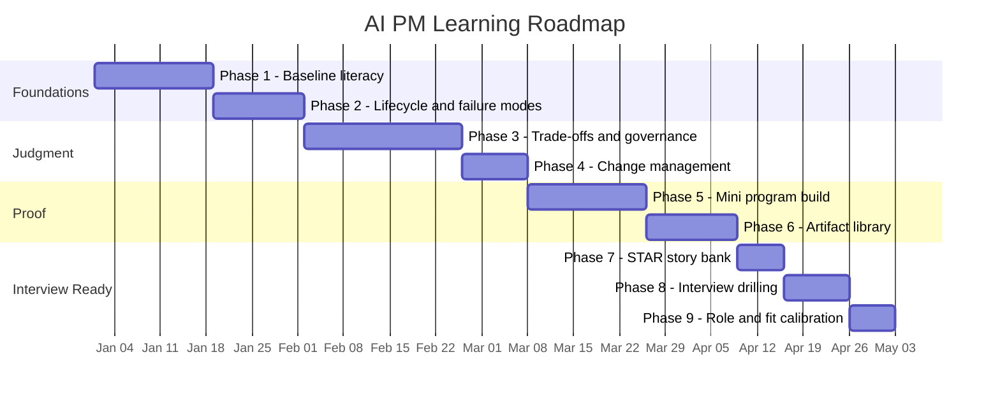

# Project 1 — AI Program Delivery

**Author:** Karun Mehta · AIGP · PMP
**Focus:** Learning the concepts, lifecycle, and judgment layer behind running AI programs — the foundation before you touch the prompt library.

---

## AI PM Learning Roadmap

A practical map for operating as a Program Manager on AI initiatives. Organized around one core idea: **the AI is one variable in the program — the program management around it is the whole job.**

## Roadmap at a Glance

| Phase | Focus | Target Duration | Deliverable |
|---|---|---|---|
| 1 | Baseline AI literacy | 2–3 weeks | Can follow a technical review without translation |
| 2 | AI lifecycle & failure modes | 2 weeks | Risk register mapped to real AI failure patterns |
| 3 | Judgment layer (trade-offs, root cause, governance) | 3–4 weeks | Can defend a recommendation under pushback |
| 4 | Change management & adoption | 1–2 weeks | Adoption plan for a real or simulated rollout |
| 5 | Proof — mini program build | 2–3 weeks | One end-to-end artifact (working prototype + docs) |
| 6 | Artifact library | Ongoing | Risk framework, governance template, scorecard |
| 7 | STAR story bank | 1 week | 6–8 adaptable behavioral stories |
| 8 | Interview drilling | 1–2 weeks | Pressure-tested answers, recorded and reviewed |
| 9 | Role/company-fit calibration | Ongoing | Clear read on which AI PM lane fits a given role |

**Note on Phases 5–9:** these run partly in parallel with a real job search rather than strictly sequentially — the mini program build (5) and artifact library (6) feed directly into the STAR stories (7), and interview drilling (8) continues right up to the interview itself while role-fit calibration (9) is refined per opportunity.

---

## 1. Baseline AI Literacy (enough to ask sharp questions, not write code)

You don't need to build models. You need enough fluency to sit in a technical review and follow — and push on — the conversation.

- **Supervised vs. unsupervised** — not the math, the implications: what data does each approach need, and what does that mean for your data-dependency timeline?
- **Training vs. inference** — training is a capex-like cost (GPU hours, one-time-ish); inference is a recurring per-query cost. This split drives every budget conversation.
- **LLM basics** — tokens, context windows, why hallucination happens. Your team references this daily; you need the intuition, not the architecture.
- **RAG vs. fine-tuning** — RAG keeps knowledge external and current; fine-tuning bakes it in. Affects cost, timeline, and long-term maintenance burden. You'll be in the room for this decision.
- **Agents vs. chatbots** — autonomy levels, tool-use patterns, human-in-the-loop checkpoints. Fastest-growing category in enterprise AI; assume your next program touches this.
- **Evals** — deterministic, probabilistic, human, LLM-as-judge, golden test sets. This is the concept that defines "done" for an AI program. Without it, you have no launch gate.

**Self-check:** Could you ask a follow-up question sharp enough that an ML engineer thinks *this PM actually gets it*?

---

## 2. How AI Programs Actually Run (and Fail)

Traditional software programs are linear. AI programs are a loop, and they fail in specific, recurring ways.

**The lifecycle is circular, not waterfall:**
Data collection → cleaning → labeling → training → fine-tuning → deployment → monitoring → retraining → (back to data)

**Common failure modes to build a real risk register around:**
- Model drift
- Data quality issues
- Training-serving skew
- Cold start problems
- Feedback loop corruption
- Evaluation gaps (no shared definition of "good")

**Planning under uncertainty** — traditional programs commit to timelines; AI programs run experiments that are allowed to fail. Plan with:
- Milestone/quality gates instead of fixed calendar dates
- Explicit experiment budgets (time set aside for approaches that may not work)
- Parallel workstreams with defined convergence points

**Cost modeling** — training GPU-hours, inference-per-token, retraining-per-cycle. If you can't model this, you can't have a credible budget conversation with leadership.

**Post-launch is not the finish line** — launch is closer to the *start* of the operational commitment: monitoring framework, retraining cadence, incident response, rollback procedure. This is ongoing ops, not a project closeout.

---

## 3. The Judgment Layer (what separates schedule-managers from outcome-drivers)

This is what interviewers actually probe for.

- **Technical translation under pressure** — the same problem gets described four different ways (ML engineer, data engineer, product, VP). The PM's job is to hear all four as one problem and unblock it. Practice explaining one technical concept in three registers: engineering, product, executive.
- **The AI metrics stack** — beyond accuracy: precision, recall, F1, latency, cost-per-query, hallucination rate, refusal rate, user satisfaction. Know which metrics matter for which use case, and how to report them upward in plain terms.
- **Root cause diagnosis** — Segment → Correlate → Isolate. Practice on real prompts: *"Downvotes jumped 35% — what's your next move?"* / *"Accuracy dropped 91%→82% after a data refresh — walk me through the next 48 hours."*
- **Trade-off reasoning** — ship at 85% or wait for 92%? RAG or fine-tune? Build or buy? The PM either makes the call or presents options with a clear recommendation — not just data.
- **Governance** — who approves new AI use cases, who reviews models pre-deployment, what data is trainable, what happens on a biased output. **Governance runs parallel to delivery, not as a final checkpoint** — this framing is a differentiator, not a nice-to-have.
- **Change management** — the hardest part of an AI program is adoption, not the model. Resistance is often rational (job-loss fear, trust gaps, tools that don't work). Own the training, comms, feedback loop, and success measurement.

---

## 4. Turning Knowledge into Proof

Undemonstrated knowledge is invisible in an interview.

- **Run a mini program end-to-end** — pick a real, scoped problem (e.g., a GenAI FAQ bot for internal docs), plan it with milestone gates, build a working prototype, evaluate against defined criteria, and write the artifacts as if it were a real program: status update, risk register, stakeholder comms.
- **Build an artifact library** — AI risk framework template, governance process template, vendor evaluation scorecard, milestone-based program plan, a root-cause write-up. Each artifact = one demonstrable skill.
- **Convert artifacts into interview answers** — the mini program → "tell me about an AI program you ran." The risk framework → "how do you manage AI-specific risk." The RCA → "the model just regressed, what do you do."
- **Build a STAR story bank** — cover: program planning, stakeholder alignment, technical translation, risk management, trade-off decisions, change management, incident response. Six to eight adaptable stories.
- **Drill under pressure** — practice out loud, record it, listen back: *"Downvotes are up 35% — walk me through your investigation."* / *"Eng says 14 weeks, product says 8 — how do you resolve it?"* / *"Your LLM API provider just raised prices 40% — what's the plan?"*

---

## Differentiators worth owning in interviews

- Governance as a **parallel track**, not a gate at the end
- Evaluation as a **first-class workstream**, not an afterthought
- Clear separation of **PM vs. Program Manager vs. TPM vs. Ethical/Responsible AI Lead**
- Awareness that the AI PM role **varies by company type and by which layer of the AI stack you sit on** (infra vs. model vs. application layer)
- GenAI vs. ML/predictive programs require different depths of technical fluency — know which lane a target role is in before you walk in

---
