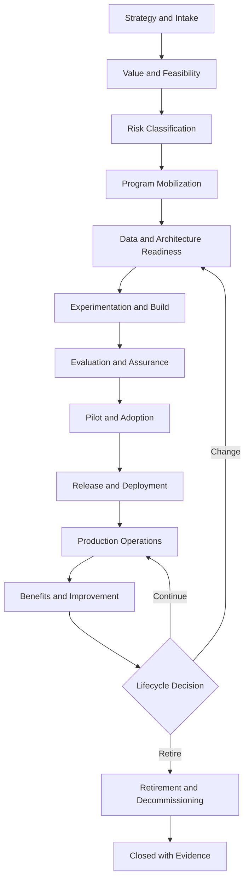
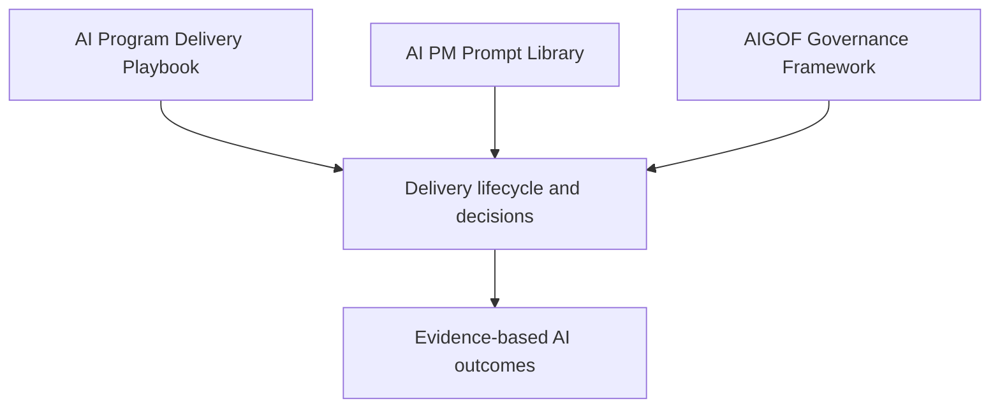

# Project 1 - Enterprise AI Program Delivery Playbook

**Author:** Karun Mehta, AIGP, PMP

**Tagline:** Align strategy. Govern risk. Deliver measurable AI outcomes.

> **Portfolio and educational use.** This playbook provides reusable delivery practices for enterprise AI programs. It does not replace organizational policy, legal advice, security review, financial approval, regulatory interpretation, or accountable human decision-making.

---

## Executive Summary

Enterprise AI delivery requires more than coordinating model development. It requires an integrated operating model connecting business value, product delivery, data readiness, engineering, evaluation, governance, security, operations, adoption, and benefits realization.

This playbook defines how an AI Program Manager can lead an initiative from intake through retirement while maintaining clear ownership, measurable stage gates, evidence-based decisions, and responsible human oversight.

The central principle is simple:

> AI governance runs with delivery from the beginning. It is not a compliance checkpoint added immediately before release.

The AI Program Manager does not replace product, engineering, data science, risk, security, legal, compliance, or operations. The role integrates their work into one outcome-driven program and makes dependencies, decisions, risks, evidence, and accountability visible.

---

## Table of Contents

1. [Purpose and Audience](#1-purpose-and-audience)
2. [What Makes AI Program Delivery Different](#2-what-makes-ai-program-delivery-different)
3. [AI Program Manager Responsibilities](#3-ai-program-manager-responsibilities)
4. [Delivery Principles](#4-delivery-principles)
5. [End-to-End AI Program Lifecycle](#5-end-to-end-ai-program-lifecycle)
6. [Parallel Delivery Workstreams](#6-parallel-delivery-workstreams)
7. [Governance and Decision Model](#7-governance-and-decision-model)
8. [Lifecycle Gates](#8-lifecycle-gates)
9. [Integrated Planning Under Uncertainty](#9-integrated-planning-under-uncertainty)
10. [Required Program Artifacts](#10-required-program-artifacts)
11. [AI Risk and Control Management](#11-ai-risk-and-control-management)
12. [Evaluation and Quality Strategy](#12-evaluation-and-quality-strategy)
13. [Release and Operational Readiness](#13-release-and-operational-readiness)
14. [Production Monitoring and Incident Management](#14-production-monitoring-and-incident-management)
15. [Change Management and Adoption](#15-change-management-and-adoption)
16. [Financial Management and AI FinOps](#16-financial-management-and-ai-finops)
17. [Benefits Realization](#17-benefits-realization)
18. [AI System Change and Configuration Control](#18-ai-system-change-and-configuration-control)
19. [Retirement and Decommissioning](#19-retirement-and-decommissioning)
20. [Metrics and Executive Reporting](#20-metrics-and-executive-reporting)
21. [AI-PMO Automation Model](#21-ai-pmo-automation-model)
22. [Example: Multi-Workstream AI Program](#22-example-multi-workstream-ai-program)
23. [Program Manager Readiness Checklist](#23-program-manager-readiness-checklist)
24. [Relationship to the Prompt Library and AIGOF](#24-relationship-to-the-prompt-library-and-aigof)
25. [Reference Frameworks](#25-reference-frameworks)

---

## 1. Purpose and Audience

This playbook is designed for:

- AI Program Managers and Technical Program Managers
- Enterprise Project and Portfolio Managers
- Product Managers and Product Owners
- AI Governance and Responsible AI leaders
- Data, ML, GenAI, platform, security, quality, and operations leads
- Executives sponsoring AI-enabled transformation

It can be applied to:

- Predictive machine learning
- Generative AI and large language models
- Retrieval-augmented generation (RAG)
- AI copilots and assistants
- Tool-using and agentic AI systems
- Third-party AI products and foundation models
- AI-enabled enterprise process automation

The playbook is tool-neutral. Teams may implement it using approved enterprise platforms such as Jira, Azure DevOps, Confluence, ServiceNow, Power BI, cloud AI platforms, model registries, observability tools, and governance systems.

---

## 2. What Makes AI Program Delivery Different

AI programs use familiar delivery disciplines, but they add uncertainty and operating risks that conventional software plans may not fully capture.

| Delivery dimension | Traditional software emphasis | Additional AI program consideration |
|---|---|---|
| Requirements | Defined functional behavior | Intended use, unacceptable use, probabilistic behavior, and uncertainty |
| Data | Transactional input and storage | Authorization, lineage, representativeness, labeling, drift, and feedback quality |
| Development | Code implements specified logic | Model behavior emerges from data, prompts, architecture, tools, and configuration |
| Testing | Expected input-output behavior | Statistical evaluation, human review, adversarial testing, and use-case-specific thresholds |
| Release | Feature and technical readiness | Residual AI risk, human oversight, monitoring, rollback, and model limitations |
| Operations | Availability, defects, and performance | Drift, hallucination, harmful output, misuse, bias, prompt attacks, and model/vendor change |
| Change control | Code and configuration versions | Model, prompt, retrieval corpus, embeddings, evaluation set, tool, and policy versions |
| Success | Scope, schedule, budget, and quality | Business value, adoption, trust, control effectiveness, model quality, latency, and unit cost |

AI delivery is iterative, but iteration does not remove the need for commitments. Programs still require forecast dates, accountable owners, approved budgets, dependency management, escalation thresholds, and evidence-based decisions.

---

## 3. AI Program Manager Responsibilities

The AI Program Manager owns integration across the program rather than the technical work of every specialist.

**Core responsibilities**

- Translate strategy into a measurable AI program outcome.
- Confirm intended use, users, affected parties, boundaries, and accountable ownership.
- Establish the integrated plan, governance model, decision rights, and reporting cadence.
- Coordinate business, product, data, engineering, governance, quality, security, operations, and change workstreams.
- Manage milestones, dependencies, resources, vendors, budgets, risks, issues, assumptions, and decisions.
- Ensure evaluation criteria and launch thresholds are defined before development is treated as complete.
- Keep governance, privacy, security, legal, compliance, and Responsible AI work aligned with delivery.
- Prepare evidence-based gate decisions without substituting AI-generated output for accountable approval.
- Lead release readiness, operational transition, incident preparation, adoption, and benefits tracking.
- Maintain traceability from intended outcome through requirements, controls, tests, approvals, production performance, and retirement.

**The AI Program Manager does not**

- approve legal interpretations;
- accept enterprise risk without delegated authority;
- certify model safety based on one score;
- replace product ownership or engineering accountability;
- convert an experiment target into an executive commitment without evidence;
- permit an AI system to approve its own deployment or control effectiveness;
- treat production launch as the end of the program.

---

## 4. Delivery Principles

**4.1 Start with the business problem**
Do not begin with a preferred model or vendor. Define the decision, task, customer problem, operational pain point, expected outcome, and non-AI alternatives first.

**4.2 Separate experimentation from commitment**
Experiments are allowed to fail within an approved time, cost, data, and risk envelope. Production commitments require stronger evidence.

**4.3 Define evidence before building**
Agree on evaluation datasets, metrics, acceptance thresholds, control evidence, and accountable approvers early.

**4.4 Run governance as a parallel workstream**
Risk classification, impact assessment, data governance, privacy, security, legal, compliance, model risk, and human oversight must progress with delivery.

**4.5 Design for human accountability**
AI may draft, analyze, recommend, or execute bounded actions. Accountable humans retain authority for material decisions, exceptions, risk acceptance, and high-impact actions.

**4.6 Treat data as a program dependency**
Data authorization, access, quality, lineage, labeling, retention, representativeness, and refresh timing affect scope, schedule, cost, risk, and quality.

**4.7 Make uncertainty visible**
Use confidence ranges, assumptions, sensitivity analysis, scenarios, decision deadlines, and contingency triggers rather than false precision.

**4.8 Build operations before launch**
Monitoring, support, incident response, rollback, access reviews, audit evidence, vendor escalation, and change control are release requirements.

**4.9 Measure value and control performance together**
An AI system is not successful if it saves time but creates unacceptable risk, or if it is well-controlled but produces no measurable value.

**4.10 Maintain full traceability**
Preserve the relationship among intended purpose, requirements, data, model, prompts, tools, controls, evaluations, findings, approvals, releases, incidents, and changes.

---

## 5. End-to-End AI Program Lifecycle

**Lifecycle overview**

| Phase | Program objective | Primary activities | Required evidence |
|---|---|---|---|
| 1. Strategy and Intake | Confirm that a legitimate business need exists | Define problem, intended use, sponsor, users, affected parties, outcomes, constraints, and alternatives | AI use-case intake record |
| 2. Value and Feasibility | Determine whether the initiative merits investment | Assess benefit hypothesis, process impact, data feasibility, technical feasibility, cost range, vendor options, and non-AI alternatives | Business case and feasibility assessment |
| 3. Risk Classification | Determine the level of governance required | Assess impact, autonomy, data sensitivity, jurisdictions, affected individuals, decision consequence, security, third-party, and regulatory factors | Preliminary AI risk tier and required reviews |
| 4. Program Mobilization | Establish authority, funding, teams, plan, and controls | Approve charter, RACI, workstreams, milestones, funding, delivery model, governance forums, RAID, and escalation paths | Approved charter and integrated program plan |
| 5. Data and Architecture Readiness | Validate foundations before full build | Approve data use, lineage, access, quality, architecture, model approach, integration, hosting, vendor, identity, and environment strategy | Data-readiness and architecture decisions |
| 6. Experimentation and Build | Develop and compare viable solution options | Run controlled experiments, build pipelines, configure models, engineer prompts, implement retrieval, integrate tools, and track results | Experiment log and selected candidate solution |
| 7. Evaluation and Assurance | Demonstrate fitness for intended use | Execute functional, model, RAG, safety, fairness, security, privacy, performance, resilience, accessibility, and human evaluations | Evaluation report, findings, and residual-risk record |
| 8. Pilot and Adoption | Validate performance in a bounded real-world setting | Run limited rollout, train users, collect feedback, measure overrides, confirm workflows, and test support readiness | Pilot results and scale recommendation |
| 9. Release and Deployment | Make an accountable production decision | Validate release gates, cutover, rollback, monitoring, support, communications, approvals, and exception handling | Go, Conditional Go, or No-Go decision record |
| 10. Production Operations | Keep the AI system effective and controlled | Monitor quality, drift, safety, access, latency, cost, vendor performance, incidents, overrides, and feedback | Operational scorecard and incident evidence |
| 11. Benefits and Improvement | Confirm measurable value and prioritize improvements | Compare outcomes to baseline, measure adoption and ROI, review control effectiveness, and maintain the improvement backlog | Benefits-realization report |
| 12. Continue, Change, or Retire | Make a lifecycle decision based on evidence | Continue unchanged, remediate, retrain, replace model/vendor, reduce autonomy, suspend, or retire | Approved lifecycle decision |

**Lifecycle rule**

No phase is complete because a document exists. A phase is complete when the required evidence has been validated and the authorized decision owner has approved progression.

---

## 6. Parallel Delivery Workstreams

AI programs should be managed through coordinated workstreams with defined convergence points.

| Workstream | Scope | Typical accountable leader |
|---|---|---|
| Business and Product | Intended purpose, users, process, requirements, value, roadmap, acceptance, and adoption | Business or Product Owner |
| Data | Data authorization, sourcing, contracts, lineage, quality, labeling, access, retention, and monitoring | Data Owner |
| AI and Engineering | Architecture, model, RAG, prompts, agents, integrations, infrastructure, CI/CD, and observability | Engineering or AI Technical Lead |
| Evaluation and Quality | Evaluation strategy, datasets, test execution, traceability, defects, findings, and quality gates | Quality or Evaluation Lead |
| Governance and Risk | Risk classification, impact assessment, controls, fairness, transparency, model risk, and approvals | AI Governance or Risk Owner |
| Security and Privacy | Threat modeling, identity, access, data protection, testing, vulnerabilities, and incident controls | Security and Privacy Owners |
| Operations and Reliability | Environments, deployment, monitoring, support, service levels, incidents, rollback, and continuity | Service or Operations Owner |
| Change and Adoption | Stakeholder readiness, communications, training, workforce impact, feedback, and adoption | Change or Business Readiness Lead |
| Finance and Vendor | Funding, forecasts, unit economics, contracts, licensing, capacity, and vendor performance | Finance or Vendor Owner |

**Required convergence points**

- Business requirements and intended use align with the architecture.
- Data authorization and availability support the delivery plan.
- Evaluation measures reflect business impact and AI risk.
- Governance controls are implemented and testable.
- Release criteria connect technical results to operational readiness.
- Adoption and support plans reflect the actual user workflow.
- Production monitoring measures both value and risk.

---

## 7. Governance and Decision Model

**Governance forums**

| Forum | Purpose | Typical cadence | Example decisions |
|---|---|---|---|
| Executive Steering Committee | Strategic direction, funding, priority, material risk, and unresolved escalations | Monthly or milestone-based | Continue, change scope, increase funding, pause, or stop |
| AI Governance Review | Risk classification, control obligations, impact assessment, exceptions, and residual risk | At intake and material gates | Approve assessment, require controls, or reject operating mode |
| Program Leadership Review | Integrated delivery health, dependencies, decisions, resources, and forecast | Weekly | Resolve cross-workstream conflicts and approve corrective actions |
| Architecture and Data Review | Architecture, data, integration, platform, vendor, and non-functional decisions | At design and material change | Approve model, RAG, platform, data, and integration decisions |
| Evaluation and Release Review | Evaluation results, findings, readiness, exceptions, and rollout conditions | Before pilot and production | Approve pilot, conditional release, or no-go recommendation |
| Operational Review | Production quality, drift, incidents, cost, adoption, controls, and improvement | Weekly or monthly | Remediate, retrain, reduce autonomy, suspend, or continue |

**Decision record requirements**

Every material decision should include:

- decision ID and date;
- question being decided;
- decision owner and approving forum;
- options considered;
- evidence reviewed;
- assumptions and uncertainties;
- risks and trade-offs;
- selected decision and rationale;
- conditions, actions, owners, and due dates;
- affected scope, plan, budget, controls, or baseline;
- review or expiration date;
- links to supporting artifacts.

**Technical translation: one fact, three registers**

An AI Program Manager must translate technical information without changing the underlying fact, evidence, uncertainty, or severity. The level of detail and the decision context should change for the audience, but the truth should not.

*Example verified fact: Production behavior differs from evaluation results because feature data is arriving late.*

| Audience | Appropriate translation |
|---|---|
| Engineering | Training-serving skew is occurring because feature-store latency causes production inference to use delayed values. Segment-level validation and pipeline timing analysis are required. |
| Product | The live system is using different information from what was tested, which is creating inconsistent user results. The team is isolating the affected journeys and data path. |
| Executive | A production data-timing issue is causing inconsistent AI results. Exposure is being assessed, containment is active, and a validated recovery forecast will follow. |

For each audience, communicate:

- the same verified fact;
- the business or technical impact relevant to that audience;
- what is known, assumed, and still unknown;
- the action underway;
- the owner and next update time;
- any decision or support required.

Do not simplify a message by removing material risk, changing confidence, or presenting an unverified cause as fact.

**Escalation principles**

Escalate when:

- a decision will miss its required decision-by date;
- a critical dependency lacks an accountable commitment;
- actual or forecast performance crosses an approved threshold;
- an unacceptable use or prohibited operating mode is identified;
- control evidence is missing or a mandatory control fails;
- a release condition cannot be satisfied;
- residual risk exceeds approved tolerance;
- the AI system behaves outside its intended purpose;
- an incident may cause legal, financial, safety, privacy, customer, or reputational harm.

---

## 8. Lifecycle Gates

| Gate | Decision | Minimum evidence | Typical authority |
|---|---|---|---|
| G0 - Intake | Should the use case enter discovery? | Problem, sponsor, intended use, users, affected parties, preliminary value, and initial risk indicators | Portfolio or Business Owner |
| G1 - Feasibility | Should the organization invest in planning and experimentation? | Business case, alternatives, data feasibility, technical feasibility, cost range, and preliminary risk tier | Sponsor and Portfolio Forum |
| G2 - Mobilization | Is the program authorized to begin delivery? | Charter, funding, RACI, integrated plan, governance model, and required reviews | Sponsor and Steering Committee |
| G3 - Design Readiness | Is the proposed design acceptable for build? | Architecture, data approval, model/vendor decision, threat model, control plan, and evaluation strategy | Architecture, Data, Security, and AI Governance Authorities |
| G4 - Evaluation Readiness | Is the solution ready for formal testing? | Stable candidate, evaluation datasets, thresholds, environments, traceability, monitoring design, and known limitations | Product, Engineering, Quality, and Risk Owners |
| G5 - Pilot Readiness | Is bounded real-world use authorized? | Evaluation results, open findings, user controls, training, support, monitoring, pilot scope, and rollback | Business, Risk, Security, and Operations Authorities |
| G6 - Production Release | Is the system ready for production? | Pilot evidence, release pack, residual risk, exceptions, cutover, rollback, monitoring, incident response, and approvals | Authorized Release Authority |
| G7 - Scale or Continue | Should use expand or continue? | Production performance, adoption, benefits, incidents, control effectiveness, cost, and capacity | Sponsor and AI Governance Forum |
| G8 - Change or Retire | Should the system change, pause, be replaced, or retire? | Lifecycle evidence, change impact, replacement plan, data disposition, user transition, and closure controls | System Owner and Governance Authorities |

**Gate outcomes**

Each gate should result in one recorded disposition:

- Approved
- Approved with Conditions
- Hold for Evidence
- Rework Required
- Rejected
- Suspended
- Retired

Conditional approval must include the condition, compensating control, accountable owner, due date, expiration, monitoring requirement, and exception authority.

**Right-sizing gates by risk tier and organizational maturity**

The complete G0–G8 model provides a reference structure. Organizations should combine, simplify, or strengthen gates according to their approved risk methodology, regulatory obligations, delivery scale, and organizational maturity — applying the full sequence uniformly to every initiative regardless of risk creates process overhead that slows low-risk experimentation without improving safety where it doesn't matter, which is one of the more common criticisms of enterprise AI governance in practice today.

> The risk tiers and gate mappings below are illustrative. Organizations must apply their own approved risk-classification methodology, policies, and regulatory requirements rather than adopting this table as-is.

NIST's AI Risk Management Framework describes its own playbook as context-specific guidance to be tailored to the system and its risk — not a mandatory checklist to be followed identically for every use case. The tailoring model below applies that same principle to delivery.

| Risk tier | Delivery approach |
|---|---|
| Low | Lightweight intake, documented ownership, basic evaluation and monitoring |
| Moderate | Formal risk assessment, evaluation plan, pilot, operational approval, and periodic review |
| High | Independent validation, expanded control testing, executive governance, and restricted rollout |
| Critical | Specialized regulatory review, intensive assurance, continuous oversight, and strict operating limits |

Mapped onto the gate sequence in this section:

| Risk tier | Mandatory gates | Gates that can be combined or lightened |
|---|---|---|
| Low | G0, G6 | G1 through G5 compress into a single lightweight intake-to-pilot review; G7/G8 become a standing periodic check rather than a per-change gate |
| Moderate | G0, G2, G4, G6, G8 | G1+G3 combine into a single mobilization review; G5 folds into G6 as a combined pilot-to-release decision |
| High | G0, G1, G2, G3, G4, G5, G6, G7, G8 | None — full sequence, with independent validation at G4 and G6 |
| Critical | G0, G1, G2, G3, G4, G5, G6, G7, G8 | None — full sequence, with specialized regulatory review layered on top of the relevant gates |

**How to apply this in practice**

- Set the risk tier at intake (Section 11 / AI-PM-01-equivalent triage) before deciding how many gates apply — the tier decision is what should be rigorous, not necessarily every downstream gate.
- Even at Low tier, never skip the human-approval principle in Section 13 — compression means fewer named forums, not the removal of accountable sign-off.
- Reassess the tier if scope, autonomy, or user population grows — a Low-tier internal tool that becomes customer-facing should re-enter the full gate sequence at the point the risk profile changes, not retroactively.
- Document the compression decision itself — which gates were combined or skipped and why — so an auditor or successor PM can see it was a deliberate risk-based choice, not an omission.

The judgment to compress this model correctly — knowing which two or three gates actually matter for a given program, rather than running all nine by default — is itself a core AI Program Manager skill, not a shortcut around the framework.

---

## 9. Integrated Planning Under Uncertainty

**Plan with dates and evidence**

AI programs require both:

- forecast dates for coordination, funding, dependencies, and executive decisions; and
- evidence-based exit criteria that prevent a date from overriding quality or safety.

**Recommended planning model**

- Define outcome-based milestones.
- Attach measurable exit criteria and required evidence.
- Decompose work across all delivery workstreams.
- Identify internal, external, technical, data, vendor, governance, environment, and decision dependencies.
- Estimate using ranges and a documented basis of estimate.
- Reserve bounded experiment capacity for uncertain approaches.
- Establish convergence points across workstreams.
- Track critical-path candidates and decision latency.
- Maintain target, risk-adjusted, and recovery scenarios.
- Reforecast when evidence, scope, risk, capacity, data, vendor, or model assumptions materially change.

**Experiment management**

Every experiment should define:

- hypothesis;
- intended learning;
- dataset and environment;
- model, prompt, retrieval, tool, and configuration versions;
- success and stop criteria;
- time and cost limit;
- owner;
- risks and controls;
- result;
- decision and next action.

Failed experiments are useful when they produce documented learning within the approved envelope. Repeated experiments without decision criteria create unmanaged schedule and cost exposure.

**AI delivery backlog structure**

An AI program's backlog is not just feature work. Whatever tool tracks it (Jira, Azure DevOps, or another system of record), the backlog should visibly distinguish these work types so capacity and risk are managed explicitly rather than hidden inside a single undifferentiated queue:

- Business features
- Data work
- Experiments
- Model or prompt changes
- Evaluation work
- Governance and control tasks
- Security work
- Technical enablers
- Operational readiness
- Adoption activities
- Defects and findings
- Technical debt

**AI-specific Definition of Done**

A release-bound AI feature, experiment, model, prompt, data, integration, or control work item should satisfy the applicable Definition of Done criteria below. Not every item requires every criterion — a data-cleanup task and a production model release carry different obligations; apply "where applicable" throughout:

- Requirements are traced to the item, where applicable.
- Evaluation has been completed against the relevant dataset, where applicable.
- Acceptance thresholds are satisfied, or an accepted exception is recorded, where applicable.
- Required controls have been tested, where applicable.
- Monitoring is configured for anything reaching production, where applicable.
- Documentation is updated, including model/system card entries, where applicable.
- Required approvals are recorded per the approval matrix in Section 8, where applicable.

---

## 10. Required Program Artifacts

| Artifact | Purpose | Primary owner | Lifecycle use |
|---|---|---|---|
| AI Use-Case Intake | Capture intended purpose, sponsor, users, affected parties, data, autonomy, benefits, and initial risks | Business Owner | Intake |
| Business Case and Value Hypothesis | Define baseline, benefits, cost range, assumptions, alternatives, and success measures | Sponsor and Product | Feasibility |
| AI Program Charter | Establish objectives, scope, authority, funding, governance, milestones, and success criteria | Program Manager | Mobilization |
| Stakeholder Map and RACI | Define engagement, decision rights, responsibility, accountability, consultation, and escalation | Program Manager | All phases |
| Integrated Program Plan | Connect deliverables, milestones, dates, owners, dependencies, resources, and evidence | Program Manager | Planning and control |
| RAID Register | Control risks, assumptions, issues, and dependencies | Program Manager and Risk Owners | All phases |
| Decision Register | Preserve material decisions, rationale, evidence, conditions, and impacts | Program Manager | All phases |
| AI System Inventory Record | Identify model, vendor, version, owner, purpose, users, data, deployment, and risk tier | System Owner | Design through retirement |
| Data Readiness Assessment | Confirm authorization, lineage, access, quality, labeling, representativeness, retention, and monitoring | Data Owner | Design |
| Architecture Decision Record | Document build/buy, model, RAG, hosting, integration, tools, memory, security, and alternatives | Technical Lead | Design and change |
| AI Impact and Risk Assessment | Assess affected parties, rights, fairness, safety, privacy, explainability, security, and oversight | AI Governance and Risk | All material gates |
| Control and Evidence Matrix | Map risks to controls, owners, implementation, tests, results, and evidence | Control Owners | Build through operations |
| Evaluation Strategy | Define datasets, metrics, thresholds, segments, methods, reviewers, and release rules | Evaluation Lead | Design and assurance |
| Requirements Traceability Matrix | Link objectives to requirements, controls, tests, findings, and approvals | Product and Quality | Build through release |
| Model or System Card | Document intended use, limitations, training/evaluation context, metrics, risks, and ownership | Technical and Product Owners | Assurance and operations |
| Release Decision Pack | Consolidate scope, evaluation, findings, exceptions, residual risks, cutover, rollback, support, and approvals | Program and Release Leads | Release |
| Monitoring and Incident Plan | Define production metrics, thresholds, alerts, ownership, containment, escalation, rollback, and communications | Operations Owner | Release and operations |
| Adoption and Training Plan | Prepare users, workflow, support, communications, feedback, and adoption measures | Change Lead | Pilot and scale |
| Benefits-Realization Plan | Track outcomes, adoption, efficiency, cost, quality, risk, and benefit ownership | Business Owner | Operations |
| Change Record | Assess model, prompt, data, retrieval, tool, vendor, control, and policy changes | Change Owner | Operations |
| Retirement Plan | Control shutdown, access removal, integrations, data, records, vendor obligations, and user transition | System and Operations Owners | Retirement |

---

## 11. AI Risk and Control Management

**AI risk categories**

| Category | Example risks |
|---|---|
| Intended Use | Use outside approved purpose, user misunderstanding, or unacceptable operating mode |
| Data | Unauthorized use, poor quality, missing lineage, bias, leakage, stale data, or feedback corruption |
| Model Quality | Inaccuracy, instability, overfitting, underperformance, calibration failure, or drift |
| Generative AI | Hallucination, unsupported claims, unsafe content, over-refusal, or unreliable citations |
| RAG | Poor retrieval, unauthorized sources, stale indexes, weak chunking, missing citations, or access-control leakage |
| Agentic AI | Excessive agency, tool misuse, goal drift, cascading actions, unsafe memory, or weak human approval |
| Fairness and Impact | Unequal performance, discriminatory outcomes, accessibility barriers, or harm to affected groups |
| Privacy | Personal-data misuse, overcollection, retention failure, inference of sensitive attributes, or data exposure |
| Security | Prompt injection, jailbreak, credential misuse, data exfiltration, supply-chain compromise, or insecure integration |
| Transparency | Undisclosed AI use, insufficient explanation, unclear limitations, or weak user recourse |
| Human Oversight | Automation bias, ineffective review, missing override, unclear accountability, or approval fatigue |
| Third Party | Vendor outage, silent model change, pricing change, data terms, lock-in, concentration, or weak audit rights |
| Operations | Monitoring gaps, alert failure, capacity limits, latency, rollback failure, or inadequate support |
| Compliance | Policy, contractual, legal, regulatory, records, or jurisdictional obligations not met |
| Financial | Uncontrolled token cost, capacity waste, inaccurate forecast, benefit leakage, or unexpected licensing cost |
| Reputation | Harmful output, customer distrust, public incident, misleading claims, or inconsistent communication |

**Risk register requirements**

Every material AI risk should include:

- unique ID and category;
- cause, event, and impact statement;
- affected users, groups, process, or systems;
- inherent likelihood and impact;
- existing and planned controls;
- control owner and evidence;
- residual likelihood and impact;
- trigger or early-warning indicator;
- response strategy;
- mitigation and contingency;
- decision or escalation threshold;
- review cadence;
- risk acceptance authority;
- current status and trend.

**Control design principles**

- Controls should be tied to a specific risk and intended outcome.
- Preventive, detective, corrective, and governance controls should be distinguished.
- Control ownership should be separate from independent validation where material.
- Human review must be meaningful, informed, timely, and authorized.
- Technical controls should produce testable evidence.
- Exceptions should be time-bound and monitored.
- Controls must be reassessed after material changes.

**Agentic AI delivery overlay**

Agentic systems — autonomous, tool-using agents — carry risks broad enough to warrant their own visible checklist rather than sitting only inside the general risk categories above. Before any agentic AI system progresses past design readiness (G3), confirm each of the following is defined and owned:

- Agent inventory and ownership — every agent is registered with a named accountable owner, not just a technical contact.
- Autonomy classification — mapped to the Autonomy Levels in Section 21 (L0–L4), not assumed.
- Unique non-human identity — no agent operates under a shared human credential.
- Least-privilege tool permissions — each tool grant is scoped to the minimum required for the agent's bounded purpose.
- MCP/API/tool allowlisting — the agent can only call explicitly approved tools and endpoints.
- Memory and context controls — what the agent retains across sessions, and how that memory is protected from contamination.
- Action-level approval matrix — which actions the agent may take unsupervised versus which require human approval, per action, not per agent.
- Reversibility and transaction limits — irreversible or high-value actions are identified and gated separately from routine ones.
- Multi-agent handoffs — where one agent's output becomes another agent's input, the handoff itself is logged and validated, not assumed correct.
- Sandbox and simulation — the agent has been tested in an isolated environment before touching production data or systems.
- Kill switch — a tested, reliable mechanism exists to halt the agent immediately, independent of the agent's own cooperation.
- Complete action traceability — every action the agent takes is logged with enough context to reconstruct what happened and why, after the fact.

This overlay does not replace AI-PM-03 (Agentic AI Deployment Readiness) in the prompt library — it is the checklist that prompt is designed to produce evidence against.

---

## 12. Evaluation and Quality Strategy

AI evaluation is a first-class program workstream and a lifecycle process, not a one-time test event.

**Evaluation layers**

| Layer | Example evaluation areas |
|---|---|
| Business | Task completion, decision quality, cycle time, customer outcome, productivity, and benefit realization |
| Functional | Requirements, workflow, integration, UI, API, batch, error handling, and recovery |
| Model | Accuracy, precision, recall, F1, calibration, robustness, drift, or use-case-specific performance |
| GenAI | Groundedness, relevance, completeness, citation quality, consistency, refusal, uncertainty, and harmful output |
| RAG | Retrieval precision/recall, source authorization, freshness, chunking, ranking, citations, and access enforcement |
| Agent | Goal adherence, tool selection, permission use, plan quality, action correctness, memory, and safe stopping |
| Responsible AI | Fairness, transparency, explainability, accessibility, human oversight, and affected-party impact |
| Security and Privacy | Injection, jailbreak, leakage, access bypass, credential handling, logging, retention, and adversarial behavior |
| Non-functional | Latency, availability, scalability, resilience, rate limits, interoperability, observability, and cost |
| Human | Expert review, usability, trust calibration, override behavior, appeal, feedback, and operational fit |

**Evaluation dataset requirements**

Evaluation datasets should define:

- source and authorization;
- intended purpose;
- coverage and representative segments;
- normal, boundary, negative, incomplete, conflicting, adversarial, and out-of-scope cases;
- expected result or reference basis;
- reviewer and adjudication process;
- version and change history;
- leakage protection;
- refresh cadence;
- limitations.

**Acceptance thresholds**

Thresholds must be:

- specific to the intended use and impact;
- approved by accountable business, product, quality, risk, and technical owners as applicable;
- defined by metric and important segment, not only aggregate performance;
- supported by sample size and confidence appropriate to the use case;
- paired with operational thresholds, escalation triggers, and rollback rules;
- reevaluated after material changes or production drift.

No single score proves that an AI system is safe, compliant, fair, reliable, or ready for release.

---

## 13. Release and Operational Readiness

**Minimum release domains**

- Intended purpose and scope traceability
- Business acceptance and user readiness
- Functional and integration testing
- AI and model evaluation
- Responsible AI assessment
- Data authorization and quality
- Security and privacy testing
- Architecture and resilience
- Accessibility
- Performance, latency, scalability, and cost
- Model, prompt, retrieval, tool, and configuration versioning
- Monitoring and alerting
- Human oversight and override
- Support model and service ownership
- Incident response and communications
- Cutover rehearsal and rollback
- Vendor readiness and escalation
- Training and change readiness
- Open findings, exceptions, and residual risk
- Required approvals

**Release recommendation**

The program team prepares one of three evidence-based recommendations:

- **Go:** All mandatory gates passed and residual risk is within approved tolerance.
- **Conditional Go:** Authorized, time-bound conditions and compensating controls are documented.
- **No-Go:** Mandatory evidence, control, approval, or readiness criteria are not satisfied.

The AI system and any AI-assisted reporting tool must not make the final release decision.

**Common controlled-deployment patterns**

Release rarely means a single full cutover. Choose the pattern that fits the risk tier from Section 8, and combine patterns where useful:

- Shadow deployment — the system runs alongside the existing process, producing output that is logged but not acted on.
- Canary release — a small percentage of traffic or users receives the new system while the majority stays on the prior version.
- Limited user cohort — a defined, bounded group of users gets access, distinct from a percentage-based canary.
- A/B testing — the new and prior systems run concurrently for comparison against defined metrics.
- Champion-challenger model — the current production model (champion) is compared against a candidate (challenger) on live traffic before any promotion decision.
- Human-review-only launch — every output is reviewed by a human before it reaches the end user or takes effect.
- Read-only or recommendation-only mode — the system suggests but does not execute; a human takes the action.
- Phased autonomy — the system starts at a lower autonomy level (Section 21) and is promoted only after evidence at each level.
- Approved fallback model — a pre-approved simpler or prior model is ready to take over automatically if the primary system fails or is rolled back.
- Automatic or manual rollback — the rollback trigger and mechanism are defined and tested in advance, not designed at the moment of failure.

A/B testing, live-traffic comparison, and automated fallback must only be used when legally, ethically, and operationally appropriate for the affected users and use case — some contexts (e.g., decisions with safety or legal consequence for individuals) may rule these patterns out regardless of technical feasibility.

---

## 14. Production Monitoring and Incident Management

**Production monitoring domains**

| Domain | Example measures |
|---|---|
| Business | Outcome attainment, task completion, cycle time, conversion, loss avoided, or productivity |
| Adoption | Active use, repeat use, completion, abandonment, satisfaction, feedback, and override rate |
| Quality | Use-case accuracy, groundedness, error rate, unsupported-output rate, and segment performance |
| Safety and Fairness | Harmful-output rate, protected-segment variance, complaints, appeals, and control breaches |
| Reliability | Availability, latency, throughput, failures, retries, degraded-mode use, and rollback success |
| Data and Drift | Source freshness, schema change, feature drift, concept drift, retrieval drift, and data-quality incidents |
| Human Oversight | Review completion, override quality, decision latency, automation bias indicators, and escalation use |
| Security and Privacy | Injection attempts, data leakage, anomalous access, credential misuse, and policy violations |
| Financial | Token use, compute, storage, vendor charges, unit cost, budget variance, and cost per successful outcome |
| Governance | Control execution, exceptions, overdue reviews, missing evidence, and unauthorized changes |

**Incident response sequence**

1. Detect and validate the event.
2. Determine severity, affected users, systems, data, decisions, and potential harm.
3. Contain exposure by pausing, limiting, isolating, reducing autonomy, disabling tools, or invoking safe fallback.
4. Notify accountable business, technical, risk, security, privacy, legal, communications, and vendor owners as required.
5. Preserve logs, model versions, prompts, retrieval context, tool calls, approvals, and other evidence.
6. Diagnose the cause across data, model, prompt, retrieval, tools, infrastructure, access, vendor, process, and human workflow.
7. Remediate and validate the correction.
8. Obtain authorization before restoring affected capability.
9. Communicate outcome and any user remediation.
10. Complete a blameless post-incident review and verify preventive actions.

**Structured root-cause diagnosis: Segment, Correlate, Isolate**

Use Segment → Correlate → Isolate to investigate an AI performance regression before selecting a fix.

| Step | Purpose | Example actions |
|---|---|---|
| Segment | Determine where the failure occurs and where it does not | Break results down by user cohort, workflow, geography, model version, prompt version, input length, data source, retrieval source, tool, time period, and environment |
| Correlate | Identify changes or conditions associated with the failure | Compare the regression with deployments, data refreshes, prompt changes, model/vendor updates, index rebuilds, permission changes, traffic shifts, latency events, and infrastructure incidents |
| Isolate | Reproduce and narrow the smallest verified causal path | Hold variables constant, compare previous and current versions, replay affected cases, inspect logs and traces, test one suspected component at a time, and confirm the cause before remediation |

*Example: Accuracy drops from 91% to 82% following a data refresh.*

- **Segment:** Determine whether the decline affects every cohort or only specific sources, products, regions, or input patterns.
- **Correlate:** Compare the start of the decline with the refresh timestamp, schema changes, feature distributions, pipeline failures, and model configuration.
- **Isolate:** Reproduce affected cases using old and new data, identify the smallest causal difference, and validate the hypothesis before changing code, prompts, data, or model settings.

The Program Manager coordinates owners, evidence, containment, decision timing, and communication. Technical teams perform the detailed diagnosis. The team should not jump directly from a top-line metric change to a preferred solution.

**Stop and rollback triggers**

Triggers should be approved before release and may include:

- unacceptable harm or safety event;
- material privacy or security breach;
- output or action outside intended purpose;
- failed mandatory control;
- statistically or operationally significant quality degradation;
- unauthorized tool use or permission expansion;
- missing required human approval;
- severe vendor, latency, availability, or cost event;
- inability to reconstruct system behavior from retained evidence.

---

## 15. Change Management and Adoption

AI adoption depends on workflow fit, trust, capability, leadership support, and visible value.

**Change-management activities**

- Identify impacted roles, processes, customers, and control owners.
- Assess job, skill, workflow, workload, and decision-right changes.
- Involve representative users in requirements, evaluation, pilot, and feedback.
- Explain intended use, limitations, human responsibilities, escalation, and recourse.
- Provide role-based training and practice scenarios.
- Establish champions, office hours, knowledge articles, and support channels.
- Monitor adoption, abandonment, overrides, workarounds, complaints, and trust calibration.
- Feed verified user evidence into the improvement backlog.
- Address resistance as program evidence rather than treating it only as a communications problem.

**Adoption readiness questions**

- Do users understand when and when not to use the system?
- Can they identify uncertain or unsafe output?
- Do they know how to override, escalate, correct, or appeal?
- Does the system fit the actual workflow?
- Are incentives aligned with responsible use?
- Is adequate support available?
- Are affected employees and customers informed appropriately?
- Can adoption and business impact be measured against a baseline?

---

## 16. Financial Management and AI FinOps

AI cost varies by architecture, hosting, model, usage, data, evaluation, operations, vendor terms, and required controls.

**Cost categories**

- discovery and experimentation;
- data acquisition, preparation, labeling, storage, and governance;
- model development, fine-tuning, evaluation, and red teaming;
- inference, tokens, compute, embeddings, retrieval, and network usage;
- platform, licensing, observability, security, and support;
- engineering, product, quality, governance, legal, operations, and change resources;
- vendor implementation and professional services;
- monitoring, retraining, regression testing, incident response, and audit evidence;
- adoption, training, communications, and workforce transition;
- decommissioning, data disposition, and contract exit.

**Required cost views**

- approved budget and actual cost;
- forecast to complete and estimate at completion;
- fixed versus variable cost;
- one-time versus recurring cost;
- cost by environment, model, vendor, workstream, and business unit;
- cost per query, task, active user, successful outcome, or business transaction;
- sensitivity to volume, context size, model choice, caching, latency, and retraining cadence;
- vendor price, concentration, capacity, and lock-in exposure;
- benefit forecast and benefit-to-cost ratio.

Cost optimization must not bypass required quality, privacy, security, accessibility, or Responsible AI controls.

---

## 17. Benefits Realization

The business owner remains accountable for benefits. The AI Program Manager establishes the measurement system, cadence, evidence, and escalation path.

**Benefits framework**

| Element | Required definition |
|---|---|
| Baseline | Current cost, time, quality, risk, volume, satisfaction, or outcome before implementation |
| Target | Measurable expected improvement and target date |
| Owner | Accountable business leader |
| Data Source | Approved system of record and calculation method |
| Frequency | Measurement and review cadence |
| Attribution | Method for separating AI impact from other changes |
| Guardrails | Quality, customer, risk, workforce, and control measures that must not deteriorate |
| Action Threshold | Trigger for correction, redesign, scale change, pause, or retirement |

**Benefits review questions**

- Is the intended business outcome improving?
- Are benefits reaching the intended users or groups?
- Are gains sustainable after operational and control costs?
- Has risk increased elsewhere in the process?
- Are users creating manual workarounds?
- Is adoption broad, appropriate, and responsible?
- Should the solution scale, change, remain limited, pause, or retire?

---

## 18. AI System Change and Configuration Control

Material change is broader than a code deployment.

**Configuration items to control**

- model provider, family, version, parameters, and hosting;
- system and developer prompts;
- retrieval corpus, connectors, chunking, embeddings, ranking, and indexes;
- tools, APIs, MCP servers, permissions, credentials, and action limits;
- memory design, retention, and user context;
- training, fine-tuning, evaluation, and production datasets;
- evaluation methods, reference answers, metrics, and thresholds;
- filters, guardrails, business rules, and human approval gates;
- infrastructure, dependencies, orchestration, and fallback models;
- policies, control mappings, notices, and user instructions;
- vendor terms, data processing, service levels, and pricing.

**Change assessment**

Every material change should evaluate:

- reason and expected outcome;
- affected requirements, users, data, integrations, and jurisdictions;
- regression and new-risk potential;
- required evaluation and control testing;
- privacy, security, legal, compliance, and vendor impact;
- operational, support, training, and communication impact;
- cost and capacity impact;
- approval authority;
- deployment, monitoring, and rollback plan;
- records and evidence to retain.

Emergency changes should follow an approved expedited process and receive retrospective review.

---

## 19. Retirement and Decommissioning

AI retirement is a controlled lifecycle activity.

**Retirement triggers**

- intended value is no longer achieved;
- risk exceeds tolerance;
- unacceptable performance or incidents continue;
- a model or vendor is unsupported;
- law, policy, contract, or organizational strategy changes;
- operating cost is no longer justified;
- a replacement system is approved;
- data rights or authorization expire.

**Retirement checklist**

1. Approve the retirement decision and effective date.
2. Identify users, processes, systems, vendors, and downstream dependencies.
3. Plan replacement, fallback, or manual process transition.
4. Communicate to affected stakeholders.
5. Disable model endpoints, agents, tools, integrations, identities, credentials, and scheduled jobs.
6. Revoke user and non-human access.
7. Retain or dispose of data, prompts, logs, evaluations, and records according to policy.
8. Close vendor, licensing, infrastructure, and financial obligations.
9. Update AI inventory and architecture records.
10. Confirm that no unauthorized copies or shadow workflows remain.
11. Validate shutdown and archive evidence.
12. Capture lessons and reusable improvements.

---

## 20. Metrics and Executive Reporting

**Balanced AI program scorecard**

| Dimension | Example measures |
|---|---|
| Value | Benefits realized, ROI, loss avoided, revenue enabled, productivity, or customer outcome |
| Delivery | Milestone predictability, critical-path health, decision latency, dependency aging, and rework |
| Scope | Requirements stability, approved changes, backlog health, and traceability coverage |
| Financial | Budget variance, forecast, unit cost, vendor exposure, and cost per successful outcome |
| Data | Authorization, quality, freshness, lineage, labeling progress, and drift |
| AI Quality | Use-case performance, groundedness, error rate, segment performance, and regression trend |
| Risk and Controls | Residual exposure, control pass rate, exceptions, overdue actions, and audit evidence |
| Security and Privacy | Findings, attack success rate, leakage, access violations, and remediation aging |
| Reliability | Availability, latency, failure rate, capacity, alert quality, and rollback performance |
| Adoption | Active use, completion, satisfaction, abandonment, override, and responsible-use compliance |
| Operations | Incident count, severity, detection time, containment time, recurrence, and support volume |

**Executive status format**

An executive AI program update should answer:

- What business outcome are we pursuing?
- What changed since the prior report?
- Are scope, schedule, budget, quality, risk, and adoption within threshold?
- What evidence supports the status?
- What are the top risks, issues, and dependencies?
- What decisions are required, by whom, and by what date?
- What is the consequence of delayed action?
- What happens next?

RAG status should be based on approved thresholds. It should not be assigned only through subjective judgment or generated automatically without validation.

---

## 21. AI-PMO Automation Model

AI can assist the PMO when sources, permissions, validations, ownership, monitoring, and failure handling are defined.

**Autonomy levels (L0–L4)**

This scale is referenced throughout the playbook, including the Agentic AI Delivery Overlay in Section 11, to classify how much unsupervised action any AI system or agent — PMO-facing or otherwise — is permitted to take.

| Level | Permitted AI activity |
|---|---|
| L0 – Inform | Explain, summarize, and format |
| L1 – Analyze | Read approved sources, calculate, and identify issues |
| L2 – Recommend | Propose options and actions |
| L3 – Execute with Approval | Perform an authorized, reversible action after human approval |
| L4 – Bounded Automation | Perform approved, low-impact actions within defined limits |

Recommended starting position for any new AI-PMO capability or agent: L1 or L2. Progress to L3/L4 only after testing, access review, accountable approval, monitoring, rollback, and incident procedures are operating effectively.

| Capability | AI may assist with | Required human control |
|---|---|---|
| Intake | Check completeness, summarize, score using approved criteria, and route | Portfolio owner approves disposition |
| Planning | Draft WBS, milestones, scenarios, and dependency candidates | PM and workstream leads validate the baseline |
| RAID | Consolidate, classify, deduplicate, score, and identify overdue actions | Risk owners validate exposure and response |
| Reporting | Draft status from approved systems and identify conflicts | Program Manager approves before distribution |
| Quality | Map requirements to tests, summarize findings, and prepare readiness evidence | Quality and business owners accept results |
| Release | Assemble gate evidence and identify missing criteria | Authorized release authority decides |
| Monitoring | Detect threshold breaches and prepare alerts | Service and risk owners decide containment and response |
| Benefits | Calculate approved measures and identify variance | Business owner validates attribution and outcome |

**AI-PMO control requirements**

Every AI-PMO agent, skill, or workflow should define:

- bounded purpose and prohibited actions;
- approved sources and freshness requirements;
- data classification and retention;
- tool and permission allowlist;
- unique non-human identity where system access is used;
- enforced output schema;
- factual, calculation, and traceability validation;
- human approval matrix;
- monitoring and exception thresholds;
- retry, safe-stop, rollback, and kill-switch behavior;
- model, prompt, tool, and workflow versioning;
- audit evidence and accountable ownership.

Start with draft, analysis, and recommendation use cases. Introduce bounded execution only after controls have been tested and authorized.

---

## 22. Example: Multi-Workstream AI Program

Consider an enterprise AI assistant delivered across 16 business and technology workstreams.

**Program structure**

- One integrated program charter and outcome model
- One cross-workstream milestone plan
- One dependency register with provider, consumer, need-by date, commitment, and evidence
- One consolidated RAID view retaining source ownership
- Workstream-level backlogs and delivery plans
- One intended-use and AI risk classification
- One integrated requirements and control traceability model
- Shared evaluation standards with workstream-specific scenarios
- End-to-end golden business journeys
- One release-readiness heatmap
- One command structure for cutover, incidents, rollback, and escalation
- One benefits scorecard with accountable business owners

**Operating cadence**

| Cadence | Purpose |
|---|---|
| Daily | Delivery blockers, incidents, critical defects, and immediate dependencies |
| Twice weekly | Cross-workstream dependency and environment review |
| Weekly | Integrated delivery, quality, risk, financial, and decision review |
| Biweekly | Product, data, architecture, and evaluation alignment |
| Monthly | Executive steering, funding, benefits, material risk, and strategic decisions |
| Gate-based | AI governance, architecture, pilot, release, scale, change, and retirement approval |

**Integrated readiness view**

Each workstream reports evidence against common criteria:

- scope and traceability;
- data and environment;
- functional and integration testing;
- AI evaluation;
- defects and findings;
- security, privacy, accessibility, and governance controls;
- training and business readiness;
- vendor and external dependencies;
- monitoring, support, rollback, and incident readiness;
- accountable sign-offs.

The Program Manager validates the integrated view. Workstream leaders remain accountable for their evidence. Authorized business, technology, risk, governance, and release authorities retain approval.

**Illustrative case study: AI Claims Triage Assistant (fictional)**

> **All names, dates, figures, and decisions below are fictional.** This case study demonstrates how the artifacts in Section 10 fit together on one program; it is not real delivery evidence and should not be cited as such.

*Context:* A regional insurer wants an AI assistant that triages incoming claims and routes them to the right adjuster queue, flagging likely-fraud cases for human review. Risk tier: Moderate (Section 8) — internal routing decision, no autonomous payout authority, human adjuster makes every final call.

- **Intake:** Submitted by the Claims Operations VP. Problem: adjusters spend ~6 hrs/week manually triaging routine claims. Approved to advance to discovery.
- **Charter:** Objective — reduce manual triage time by a target amount within two quarters of full rollout, with fraud-flag precision as a hard guardrail. Sponsor: Claims Operations VP. PM authority: Tier 2.
- **RACI (excerpt):** Data readiness — Accountable: Data Owner (Claims Data team); Consulted: Legal, Security.
- **Integrated plan:** 12-phase lifecycle applied at Moderate tailoring — G0, G2, G4, G6, G8 as mandatory gates (per Section 8), with G1+G3 and G5+G6 combined.
- **RAID register (excerpt):** Risk — "Fraud-flag model trained on 18-month-old data may not reflect current fraud patterns." Residual score: Medium. Mitigation: refresh training data before pilot; owner: ML Lead; review cadence: monthly.
- **Evaluation scorecard (excerpt):** Routing accuracy on golden set: within approved threshold. Precision and recall thresholds for the fraud-flag model were established jointly by the Claims, Fraud, Risk, and Evaluation owners based on the operational impact of false positives and false negatives — recall was not treated as a lesser metric given that low recall risks missed suspicious claims.
- **Gate decision:** G4 (Evaluation Readiness) — Approved with Conditions. Condition: both precision and recall to be re-evaluated after 30 days of pilot data against the jointly-approved thresholds; owner: Evaluation Lead; review date set.
- **Release-readiness heatmap (excerpt):** Data authorization — Green. Security testing — Green. Human-review workflow for fraud flags — Green. Rollback rehearsal — Amber, scheduled before G6.
- **Executive status (excerpt):** Overall Amber this period — on track functionally, one open condition from G4 pending its 30-day review.
- **Benefits dashboard (excerpt):** Baseline manual triage time captured pre-launch; first post-pilot measurement scheduled 30 days after rollout, owned by Claims Operations VP.

This sequence shows the artifacts in Section 10 as a connected chain rather than a checklist completed in isolation — each one both consumes evidence from the previous step and produces evidence the next step depends on.

---

## 23. Program Manager Readiness Checklist

**Strategy and ownership**

- Business problem and intended outcome are measurable.
- Intended use, prohibited use, users, and affected parties are documented.
- Sponsor, Business Owner, Product Owner, System Owner, and Risk Owner are confirmed.
- Non-AI alternatives were considered.
- Benefits have a baseline, target, owner, source, and measurement cadence.

**Program setup**

- Charter, scope, funding, RACI, governance, and decision rights are approved.
- Parallel workstreams and convergence points are defined.
- Integrated milestones include dates, exit criteria, evidence, and owners.
- Dependencies, assumptions, constraints, and decision deadlines are visible.
- Escalation thresholds and forums are agreed.

**Data and technology**

- Data is authorized, accessible, traceable, representative, and fit for purpose.
- Data quality, labeling, refresh, retention, and monitoring are planned.
- Model, RAG, vendor, hosting, integration, identity, and access decisions are documented.
- Architecture, security, privacy, resilience, and operational requirements are approved.
- Model, prompt, retrieval, tool, data, and configuration versions are controlled.

**Governance and assurance**

- AI risk classification and impact assessment are complete.
- Risks are mapped to accountable controls and evidence.
- Evaluation datasets, metrics, segments, thresholds, and reviewers are approved.
- Functional, AI, security, privacy, Responsible AI, human, and non-functional tests are covered.
- Findings, exceptions, conditions, and residual risks have authorized dispositions.

**Release and operations**

- Pilot scope, users, controls, monitoring, success criteria, and rollback are approved.
- Production release criteria and decision authority are clear.
- Monitoring, support, incident, communication, rollback, and continuity plans are tested.
- Human review, override, escalation, and recourse are effective.
- Vendor support, service levels, change notices, and escalation are ready.

**Adoption and value**

- Users understand intended use, limitations, responsibilities, and escalation.
- Training, communications, support, feedback, and workforce impacts are addressed.
- Adoption, quality, risk, cost, and benefit measures are monitored together.
- Production reviews can result in continue, change, reduce autonomy, pause, replace, or retire decisions.
- Retirement responsibilities and evidence requirements are defined.

---

## 24. Relationship to the Prompt Library and AIGOF

This playbook defines what must be managed across an AI program.

The companion [**Project 2 – AI PM Prompts**](../project-2-ai-prompts/) provides governed prompts for producing and reviewing delivery artifacts such as:

- intake assessments;
- charters and RACI models;
- plans, estimates, dependencies, and RAID registers;
- executive reports and decision memos;
- quality, UAT, and release-readiness assessments;
- AI use-case triage;
- GenAI, RAG, and agentic AI readiness;
- AI-assisted output validation;
- prompt evaluation and change control.

The broader [**AIGOF – AI Governance Operating Framework**](https://github.com/karunmehta-aigp/AI-Governance) is maintained in the `AI-Governance` repository. It provides the detailed governance layer, including AI inventory, risk classification, control library, framework crosswalks, approval gates, policy structure, monitoring, and maturity assessment.

**Recommended relationship:**

- **Delivery Playbook:** operating model and lifecycle
- **Prompt Library:** governed execution assistance
- **AIGOF:** risks, controls, accountability, and governance evidence

The repositories should cross-reference one another without duplicating full control libraries or policies.

---

## 25. Reference Frameworks

This playbook is informed by widely recognized program-management, AI risk-management, quality, security, privacy, and management-system practices, including:

- NIST AI Risk Management Framework
- NIST AI RMF Generative AI Profile
- ISO/IEC 42001 - Artificial Intelligence Management Systems
- OECD AI Principles
- European Commission - Regulatory Framework for AI
- Project Management Institute standards and practices
- Agile, Scrum, Kanban, SAFe, DevSecOps, MLOps, LLMOps, and quality-engineering practices

Organizations should apply current laws, regulations, policies, contracts, risk tolerances, and control standards relevant to their jurisdictions and use cases.

---

## Closing Principle

AI can accelerate analysis, content generation, experimentation, and delivery coordination. It must not obscure accountability.

The strongest AI programs make the following more visible:

- intended purpose;
- business value;
- affected stakeholders;
- sources and assumptions;
- uncertainty and limitations;
- risks and controls;
- evaluation evidence;
- owners and decision rights;
- approvals and exceptions;
- production performance;
- benefits and operational costs;
- reasons to continue, change, pause, or retire.

Deliver AI as an accountable business capability, not only as a technical release.
