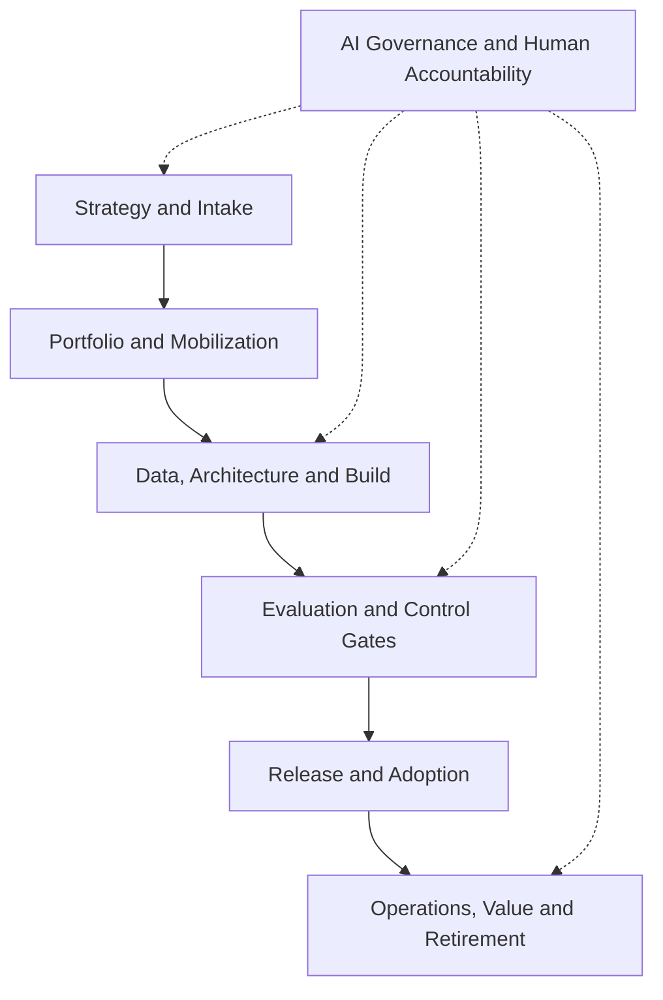

# Project 3 — AI PMO Skills

**Author:** Karun Mehta · AIGP · PMP

> **Development Status: Draft / In Progress**
>
> The skill catalog, architecture, and operating model are defined. I am currently learning, building, and validating executable Claude Code skills and agents for AI Program Management.
>
> The `SKILL.md` files, plugin metadata, and supporting reference documents described below are part of the intended target state and are not yet available in this repository. Commands and file paths should therefore be treated as design examples and are not currently executable.

A reusable skills library designed to support the governance and delivery of enterprise AI programs across investment banking, capital markets, and regulated financial-services environments.


---

## Purpose

This repository is designed as an executable Claude Code plugin demonstrating how an AI Program Manager can convert delivery practices into reusable AI skills. Each skill has a clear activation description, required inputs, workflow, controls, outputs, integrations, and decision boundary.

The collection covers the complete path from use-case intake through retirement while coordinating business, product, engineering, data, model risk, compliance, security, operations, finance, and change-management teams.

## What This Demonstrates

- End-to-end AI program and portfolio delivery
- Investment-banking front-to-back operating-model knowledge
- Reusable AI skill design using the `SKILL.md` format
- Risk-based governance integrated into delivery
- Human accountability and separation of duties
- Evidence-based gates, traceability, and audit readiness
- Benefits realization, cost control, and lifecycle management

---

## Skill Architecture



---

## Run in Claude Code

*(Target usage once the plugin is built — not yet functional.)*

**Local test**

From the parent directory of this repository:

```
claude --plugin-dir ./AI-Investment-Banking-PMO-Skills
```

Inside Claude Code, confirm the plugin and skills are visible:

```
/skills
```

**Run the complete lifecycle workflow:**

```
/ai-investment-banking-pmo:ai-program-delivery-orchestrator Create the delivery pack for a GenAI investment-research assistant using the project documents in ./project-inputs
```

**Run one specialist workflow:**

```
/ai-investment-banking-pmo:resource-capacity-allocator Resolve Q4 capacity conflicts across data engineering, model validation, compliance, and release management using ./capacity.xlsx
```

The shorter bare command may also work when it does not conflict with another installed skill:

```
/resource-capacity-allocator Analyze ./capacity.xlsx
```

After editing plugin metadata or other plugin components, run:

```
/reload-plugins
```

**Validate before publishing**

```
claude plugin validate ./AI-Investment-Banking-PMO-Skills --strict
```

**Project-local alternative**

If you do not want to load the full plugin, copy selected skill folders into the target repository:

```
.claude/skills/<skill-name>/SKILL.md
```

Project skills can then be invoked as `/<skill-name>`.

---

## Skills Matrix

### Strategy and Portfolio

| Skill | Purpose | Example triggers | Primary outputs |
|---|---|---|---|
| `ai-program-delivery-orchestrator` | Run the complete governed delivery workflow and generate the program artifact pack | "complete delivery pack," "run AI program workflow" | Versioned end-to-end program-delivery package |
| `ai-use-case-intake` | Structure an AI opportunity and establish ownership, scope, data sensitivity, and initial risk | "AI intake," "new use case," "assess AI idea" | Intake record, initial risk screen, discovery actions |
| `portfolio-prioritizer` | Rank AI initiatives using value, feasibility, risk, dependencies, capacity, and strategic fit | "prioritize portfolio," "rank initiatives" | Prioritization scorecard, portfolio recommendation |
| `business-case-value-manager` | Build the baseline business case and measurable value hypothesis | "business case," "ROI," "benefits baseline" | Business case, KPI tree, benefits register |

### Planning and Mobilization

| Skill | Purpose | Example triggers | Primary outputs |
|---|---|---|---|
| `front-to-back-workstream-planner` | Map front-office, risk, compliance, operations, finance, and technology workstreams | "front-to-back plan," "investment banking workstreams" | Workstream map, ownership model, handoff map |
| `integrated-roadmap-planner` | Build an integrated milestone plan with delivery and governance gates | "roadmap," "milestone plan," "release plan" | Integrated roadmap, gate calendar, milestones |
| `dependency-critical-path-manager` | Identify cross-team dependencies, constraints, and critical path | "dependency map," "critical path," "blockers" | Dependency register, critical path, recovery actions |
| `resource-capacity-allocator` | Match scarce skills and team capacity to prioritized work | "resource allocation," "capacity conflict," "who is available" | Capacity plan, allocation matrix, conflict options |
| `budget-forecast-finops` | Control budget, vendor spend, cloud/model cost, forecast, and AI unit economics | "budget forecast," "AI FinOps," "EAC," "token cost" | Forecast, variance analysis, cost actions |
| `raid-decision-manager` | Maintain risks, assumptions, issues, dependencies, and decisions | "RAID," "decision log," "issue review" | RAID log, decision record, escalation package |

### Requirements, Data, and AI Assurance

| Skill | Purpose | Example triggers | Primary outputs |
|---|---|---|---|
| `requirements-traceability-manager` | Trace business outcomes to requirements, controls, tests, releases, and evidence | "RTM," "traceability," "acceptance criteria" | Traceability matrix, coverage gaps |
| `data-readiness-lineage` | Assess sourcing, entitlements, quality, lineage, retention, and permitted use | "data readiness," "lineage," "access," "MNPI" | Data readiness report, lineage map, remediation plan |
| `model-evaluation-governance` | Define evaluation datasets, metrics, thresholds, validation evidence, and limitations | "model evaluation," "GenAI testing," "validation" | Evaluation plan, results scorecard, residual-risk record |
| `responsible-ai-control-orchestrator` | Coordinate fairness, explainability, privacy, security, safety, human oversight, and transparency controls | "Responsible AI review," "controls," "human oversight" | Control plan, owners, evidence and approval status |
| `regulatory-change-coordinator` | Translate regulatory or policy change into impacted requirements, controls, owners, and releases | "regulatory change," "compliance impact" | Impact assessment, obligations map, delivery plan |
| `third-party-ai-risk-manager` | Coordinate due diligence and ongoing oversight for external models, data, platforms, and vendors | "vendor AI review," "third-party model," "contract risk" | Due-diligence pack, risk findings, exit plan |

### Release, Operations, and Value

| Skill | Purpose | Example triggers | Primary outputs |
|---|---|---|---|
| `release-operational-readiness` | Coordinate pilot, go/no-go, change, support, monitoring, rollback, and approvals | "release readiness," "pilot," "go/no-go" | Readiness checklist, cutover plan, decision pack |
| `change-adoption-manager` | Drive stakeholder readiness, training, communications, procedures, and adoption | "adoption plan," "training," "change impact" | Change plan, training evidence, adoption dashboard |
| `production-monitoring-manager` | Define and review service, model, data, control, cost, and business monitoring | "production monitoring," "KPI," "KRI," "drift" | Monitoring plan, thresholds, operational dashboard |
| `ai-incident-response` | Coordinate containment, assessment, notification, remediation, and learning | "AI incident," "hallucination event," "data leakage" | Incident record, action plan, post-incident review |
| `audit-evidence-packager` | Assemble approvals, tests, logs, traceability, decisions, and exceptions for assurance review | "audit evidence," "examination pack," "control proof" | Evidence index, completeness report, evidence package |
| `benefits-realization-manager` | Measure value, adoption, cost, risk reduction, and continuation/change/retirement decisions | "benefits review," "value tracking," "retire AI" | Benefits report, corrective actions, lifecycle decision |
| `executive-steering-dashboard` | Convert portfolio data into concise executive status and decision requests | "steering update," "executive dashboard" | Executive summary, heatmap, decisions required |
| `deviation-alert-escalation` | Apply thresholds and route material deviations to accountable owners | "deviation alert," "breach," "escalation" | Alert, severity, owner, response deadline |
| `stakeholder-communications` | Produce audience-specific updates without changing approved facts | "status report," "regulator update," "stakeholder message" | Engineering, product, executive, and control updates |

---

## Investment-Banking Coverage

The skills support programs spanning:

- **Corporate and investment banking:** client onboarding, KYC, deal origination, research, document intelligence, and transaction execution
- **Sales and trading:** market data, pricing, recommendations, surveillance, trade capture, and trader-assist use cases
- **Middle office and risk:** limits, valuations, product control, market/credit risk, model validation, and exception management
- **Operations:** confirmations, settlements, reconciliations, books and records, regulatory reporting, and client servicing
- **Enterprise functions:** finance, treasury, legal, compliance, cybersecurity, data governance, third-party risk, and internal audit

---

## Standard Skill Contract

Every skill follows the same operating contract:

1. **Activate on a discriminating request.** The YAML description identifies the task and useful trigger language.
2. **Confirm minimum inputs.** Missing facts are labeled; they are not invented.
3. **Perform the domain workflow.** The skill analyzes and structures work without silently making regulated decisions.
4. **Apply control boundaries.** Human owners retain approvals, risk acceptance, legal interpretation, and production authorization.
5. **Produce reusable artifacts.** Outputs are structured for Jira, Confluence, spreadsheets, governance repositories, dashboards, or audit evidence.
6. **Record traceability.** Sources, versions, assumptions, owners, dates, decisions, and exceptions remain attributable.

---

## End-to-End Operating Flow

| Phase | Skills commonly used | Decision or evidence produced |
|---|---|---|
| 1. Intake | `ai-use-case-intake`, `business-case-value-manager` | Sponsor, outcome, scope, preliminary risk and discovery decision |
| 2. Prioritization | `portfolio-prioritizer`, `budget-forecast-finops` | Fund, defer, sequence, or reject recommendation |
| 3. Mobilization | `front-to-back-workstream-planner`, `integrated-roadmap-planner`, `resource-capacity-allocator` | Workstreams, owners, plan, capacity, governance calendar |
| 4. Design readiness | `requirements-traceability-manager`, `data-readiness-lineage`, `third-party-ai-risk-manager` | Requirements, data permissions, architecture/vendor actions |
| 5. Build and evaluation | `model-evaluation-governance`, `responsible-ai-control-orchestrator`, `raid-decision-manager` | Test evidence, control status, exceptions and residual risk |
| 6. Release | `release-operational-readiness`, `change-adoption-manager` | Pilot result, go/no-go pack, cutover, support and rollback |
| 7. Operate | `production-monitoring-manager`, `deviation-alert-escalation`, `ai-incident-response` | Monitoring evidence, alerts, incident actions |
| 8. Govern and report | `executive-steering-dashboard`, `audit-evidence-packager`, `stakeholder-communications` | Decisions, oversight reporting and evidence completeness |
| 9. Realize value | `benefits-realization-manager`, `budget-forecast-finops` | Continue, change, scale, restrict, or retire recommendation |

---

## Accountability Model

| Activity | AI skill | AI Program Manager | Authorized accountable function |
|---|---|---|---|
| Draft and analyze | Produces structured analysis from approved inputs | Validates source quality, challenges assumptions, integrates workstreams | Reviews as required |
| Recommend | Generates options, impacts, and evidence gaps | Frames trade-offs and routes the decision | Selects or rejects the recommendation |
| Approve | Never self-approves | Confirms the correct approver and evidence are present | Accepts risk, approves legal/compliance position, model use, funding, or production release |
| Operate | Supports monitoring and triage | Coordinates response and maintains traceability | System, business, risk, compliance, security, or operations owner remains accountable |

---

## Example Invocations

*(Illustrative — these describe how each skill would be invoked once built.)*

- Use `$ai-use-case-intake` to assess a GenAI research summarization assistant for investment-banking analysts.
- Use `$resource-capacity-allocator` to resolve a conflict involving model validation, data engineering, and compliance reviewers across two Q4 releases.
- Use `$model-evaluation-governance` to create an evaluation plan for a retrieval-augmented generation assistant using approved research content.
- Use `$release-operational-readiness` to prepare a go/no-go package for a trader-assist pilot with human review and rollback controls.
- Use `$audit-evidence-packager` to identify missing evidence for the quarterly AI governance review.

---

## Repository Structure

*(Target structure — most of these files do not exist yet.)*

```
AI-Investment-Banking-PMO-Skills/
├── .claude-plugin/
│   └── plugin.json
├── README.md
├── references/
│   ├── artifact-contract.md
│   └── gate-model.md
└── skills/
    ├── ai-program-delivery-orchestrator/SKILL.md
    ├── ai-use-case-intake/SKILL.md
    ├── portfolio-prioritizer/SKILL.md
    ├── resource-capacity-allocator/SKILL.md
    ├── model-evaluation-governance/SKILL.md
    ├── release-operational-readiness/SKILL.md
    └── ...
```

---

## Governance Reference Baseline

The skills are framework-aligned, not substitutes for legal, compliance, risk, or model-validation judgment. Organizations should configure thresholds, policies, and approvers for their jurisdiction and risk appetite.

- NIST AI Risk Management Framework
- NIST Generative AI Profile
- Federal Reserve SR 26-2: Revised Guidance on Model Risk Management
- FINRA Regulatory Notice 24-09: Regulatory Obligations When Using GenAI
- FINRA AI in the Securities Industry

> **Note on SR 26-2 scope:** SR 26-2 (issued April 17, 2026, replacing SR 11-7) explicitly excludes generative AI and agentic AI models from its formal scope, describing them as "novel and rapidly evolving" and directing institutions to apply existing risk-management principles by analogy rather than this guidance's binding requirements. Skills referencing SR 26-2 here — particularly `model-evaluation-governance` and `responsible-ai-control-orchestrator` — apply its underlying principles (effective challenge, continuous monitoring, risk-based oversight) to GenAI/agentic use cases voluntarily, not because the guidance formally requires it.

---

## Design Source and Adaptation

The folder-based `SKILL.md` approach was informed by the public AI-PMO Skills repository ([alexgrebeshok-coder/ai-pmo-skills](https://github.com/alexgrebeshok-coder/ai-pmo-skills)), which implements 11 skills for construction and infrastructure project management. Its construction-specific content was not reused as an investment-banking control model. This repository introduces a separate financial-services taxonomy, lifecycle, artifacts, governance boundaries, and domain workflows.

---

## Important Notice

This repository is an educational portfolio and delivery accelerator. It does not provide legal, investment, compliance, risk-acceptance, or model-validation approval. Outputs require review by authorized organizational stakeholders before use.
