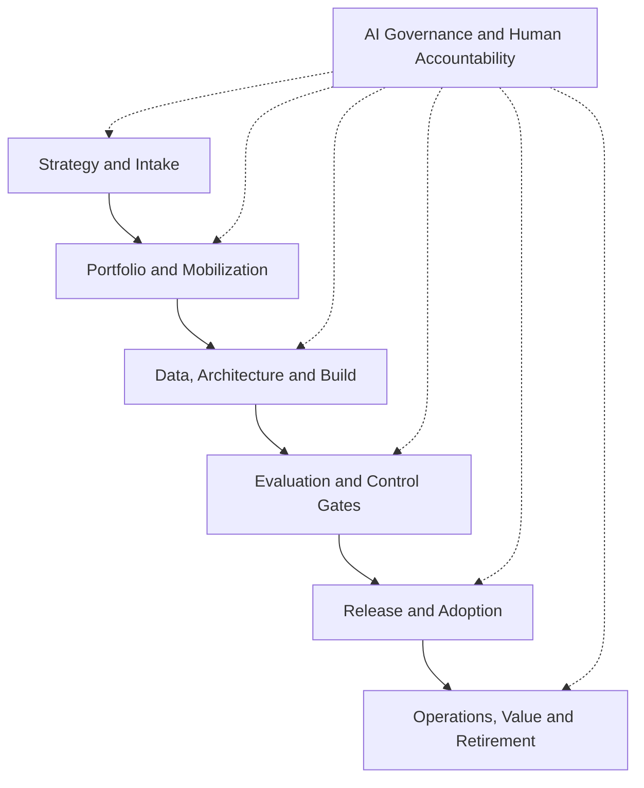

# Project 3 - Enterprise AI PMO Skills

**Author:** Karun Mehta · AIGP · PMP

**Development Status: Draft / In Progress**

> The skill catalog, target architecture, and operating model are defined. I am currently learning, building, and validating executable Claude Code skills for AI Program Management. Agent design and implementation will be introduced in a later development phase.
>
> The `SKILL.md` files, plugin metadata, and supporting reference documents described below are part of the intended target state and are not yet available in this repository. Commands and file paths should therefore be treated as design examples and are not currently executable.

A reusable skills library designed to support the governance and delivery of enterprise AI programs across industries and organizational environments.

---

## Purpose

This project defines the target architecture for a Claude Code plugin demonstrating how an AI Program Manager can convert delivery practices into reusable AI skills. Each planned skill has a clear activation description, required inputs, workflow, controls, outputs, integrations, and decision boundary.

The collection covers the complete path from use-case intake through retirement while coordinating business, product, engineering, data, AI/ML, risk, compliance, security, operations, finance, vendors, and change-management teams.

## What This Demonstrates

- End-to-end AI program and portfolio delivery
- Cross-functional operating-model design
- Reusable AI skill design using the `SKILL.md` format
- Risk-based governance integrated into delivery
- Human accountability and separation of duties
- Evidence-based gates, traceability, and audit readiness
- Benefits realization, cost control, and lifecycle management

---

## Skill Architecture



---

## Run in Claude Code

*Target usage once the plugin is built - not yet functional.*

**Local Test**

From the parent directory of this repository:

```
claude --plugin-dir ./project-3-ai-pmo-skills
```

Inside Claude Code, confirm that the plugin and skills are visible:

```
/skills
```

**Run the Complete Lifecycle Workflow**

```
/enterprise-ai-pmo:ai-program-delivery-orchestrator Create the delivery pack for an enterprise GenAI knowledge assistant using the project documents in ./project-inputs
```

**Run One Specialist Workflow**

```
/enterprise-ai-pmo:resource-capacity-allocator Resolve Q4 capacity conflicts across data engineering, model evaluation, security, compliance, and release management using ./capacity.xlsx
```

The shorter command may also work when it does not conflict with another installed skill:

```
/resource-capacity-allocator Analyze ./capacity.xlsx
```

After editing plugin metadata or other plugin components, run:

```
/reload-plugins
```

**Validate Before Publishing**

```
claude plugin validate ./project-3-ai-pmo-skills --strict
```

**Project-Local Alternative**

If the full plugin is not required, selected skill folders can be placed in the target repository at:

```
.claude/skills/<skill-name>/SKILL.md
```

Project skills can then be invoked as `/<skill-name>`.

---

## Skills Matrix

### Strategy and Portfolio

| Skill | Purpose | Example triggers | Primary outputs |
|---|---|---|---|
| `ai-program-delivery-orchestrator` | Run the complete governed delivery workflow and generate the program artifact pack | complete delivery pack, run AI program workflow | Versioned end-to-end program-delivery package |
| `ai-use-case-intake` | Structure an AI opportunity and establish ownership, scope, data sensitivity, and initial risk | AI intake, new use case, assess AI idea | Intake record, initial risk screen, discovery actions |
| `portfolio-prioritizer` | Rank AI initiatives using value, feasibility, risk, dependencies, capacity, and strategic alignment | prioritize portfolio, rank initiatives | Prioritization scorecard, portfolio recommendation |
| `business-case-value-manager` | Build the baseline business case and measurable value hypothesis | business case, ROI, benefits baseline | Business case, KPI tree, benefits register |

### Planning and Mobilization

| Skill | Purpose | Example triggers | Primary outputs |
|---|---|---|---|
| `cross-functional-workstream-planner` | Map business, product, data, technology, governance, operations, and change workstreams | workstream plan, operating model, delivery ownership | Workstream map, ownership model, handoff map |
| `integrated-roadmap-planner` | Build an integrated milestone plan with delivery and governance gates | roadmap, milestone plan, release plan | Integrated roadmap, gate calendar, milestones |
| `dependency-critical-path-manager` | Identify cross-team dependencies, constraints, and critical path | dependency map, critical path, blockers | Dependency register, critical path, recovery actions |
| `resource-capacity-allocator` | Match scarce skills and team capacity to prioritized work | resource allocation, capacity conflict, team availability | Capacity plan, allocation matrix, conflict options |
| `budget-forecast-finops` | Control budget, vendor spend, cloud/model cost, forecast, and AI unit economics | budget forecast, AI FinOps, EAC, token cost | Forecast, variance analysis, cost actions |
| `raid-decision-manager` | Maintain risks, assumptions, issues, dependencies, and decisions | RAID, decision log, issue review | RAID log, decision record, escalation package |

### Requirements, Data, and AI Assurance

| Skill | Purpose | Example triggers | Primary outputs |
|---|---|---|---|
| `requirements-traceability-manager` | Trace business outcomes to requirements, controls, tests, releases, and evidence | RTM, traceability, acceptance criteria | Traceability matrix, coverage gaps |
| `data-readiness-lineage` | Assess sourcing, authorization, quality, lineage, retention, and permitted use | data readiness, lineage, access, data quality | Data-readiness report, lineage map, remediation plan |
| `model-evaluation-governance` | Define evaluation datasets, metrics, thresholds, validation evidence, and limitations | model evaluation, GenAI testing, validation | Evaluation plan, results scorecard, residual-risk record |
| `responsible-ai-control-orchestrator` | Coordinate fairness, explainability, privacy, security, safety, human oversight, and transparency controls | Responsible AI review, controls, human oversight | Control plan, owners, evidence, and approval status |
| `policy-regulatory-change-coordinator` | Translate policy or regulatory change into impacted requirements, controls, owners, and releases | policy change, regulatory change, compliance impact | Impact assessment, obligations map, delivery plan |
| `third-party-ai-risk-manager` | Coordinate due diligence and ongoing oversight for external models, data, platforms, and vendors | vendor AI review, third-party model, contract risk | Due-diligence pack, risk findings, exit plan |

### Release, Operations, and Value

| Skill | Purpose | Example triggers | Primary outputs |
|---|---|---|---|
| `release-operational-readiness` | Coordinate pilot, go/no-go, change, support, monitoring, rollback, and approvals | release readiness, pilot, go/no-go | Readiness checklist, cutover plan, decision pack |
| `change-adoption-manager` | Drive stakeholder readiness, training, communications, procedures, and adoption | adoption plan, training, change impact | Change plan, training evidence, adoption dashboard |
| `production-monitoring-manager` | Define and review service, model, data, control, cost, and business monitoring | production monitoring, KPI, KRI, drift | Monitoring plan, thresholds, operational dashboard |
| `ai-incident-response` | Coordinate containment, assessment, notification, remediation, and learning | AI incident, harmful output, data leakage | Incident record, action plan, post-incident review |
| `audit-evidence-packager` | Assemble approvals, tests, logs, traceability, decisions, and exceptions for assurance review | audit evidence, assurance pack, control proof | Evidence index, completeness report, evidence package |
| `benefits-realization-manager` | Measure value, adoption, cost, risk reduction, and continuation/change/retirement decisions | benefits review, value tracking, retire AI | Benefits report, corrective actions, lifecycle decision |
| `executive-steering-dashboard` | Convert portfolio data into concise executive status and decision requests | steering update, executive dashboard | Executive summary, heatmap, decisions required |
| `deviation-alert-escalation` | Apply thresholds and route material deviations to accountable owners | deviation alert, threshold breach, escalation | Alert, severity, owner, response deadline |
| `stakeholder-communications` | Produce audience-specific updates without changing approved facts | status report, governance update, stakeholder message | Engineering, product, executive, and control updates |

---

## Enterprise Coverage

The planned skills support programs spanning:

- **Business and product:** use-case intake, product discovery, customer and employee workflows, value definition, prioritization, and adoption
- **Data and AI:** data sourcing, authorization, quality, lineage, model development, GenAI/RAG, evaluation, prompt management, and monitoring
- **Technology and security:** architecture, integrations, environments, access, cybersecurity, resilience, release, support, and incident response
- **Governance and assurance:** Responsible AI, privacy, legal, compliance, model risk, third-party risk, control evidence, and audit readiness
- **Operations and change:** procedures, training, communications, human oversight, operational readiness, adoption, and lifecycle support
- **Enterprise management:** portfolio planning, budgets, resources, dependencies, vendors, benefits, executive reporting, and decision governance

---

## Standard Skill Contract

Every planned skill follows the same operating contract:

1. **Activate on a discriminating request.** The YAML description identifies the task and useful trigger language.
2. **Confirm minimum inputs.** Missing facts are labeled and not invented.
3. **Perform the domain workflow.** The skill analyzes and structures work without silently making controlled decisions.
4. **Apply control boundaries.** Human owners retain approvals, risk acceptance, legal interpretation, financial authorization, and production authorization.
5. **Produce reusable artifacts.** Outputs are structured for delivery tools, knowledge repositories, spreadsheets, dashboards, governance repositories, or audit evidence.
6. **Record traceability.** Sources, versions, assumptions, owners, dates, decisions, and exceptions remain attributable.

---

## End-to-End Operating Flow

| Phase | Skills commonly used | Decision or evidence produced |
|---|---|---|
| 1. Intake | `ai-use-case-intake`, `business-case-value-manager` | Sponsor, outcome, scope, preliminary risk, and discovery recommendation |
| 2. Prioritization | `portfolio-prioritizer`, `budget-forecast-finops` | Fund, defer, sequence, combine, or reject recommendation |
| 3. Mobilization | `cross-functional-workstream-planner`, `integrated-roadmap-planner`, `resource-capacity-allocator` | Workstreams, owners, plan, capacity, and governance calendar |
| 4. Design readiness | `requirements-traceability-manager`, `data-readiness-lineage`, `third-party-ai-risk-manager` | Requirements, data permissions, architecture, and vendor actions |
| 5. Build and evaluation | `model-evaluation-governance`, `responsible-ai-control-orchestrator`, `raid-decision-manager` | Test evidence, control status, exceptions, and residual risk |
| 6. Release | `release-operational-readiness`, `change-adoption-manager` | Pilot result, go/no-go pack, cutover, support, and rollback |
| 7. Operate | `production-monitoring-manager`, `deviation-alert-escalation`, `ai-incident-response` | Monitoring evidence, alerts, incidents, and corrective actions |
| 8. Govern and report | `executive-steering-dashboard`, `audit-evidence-packager`, `stakeholder-communications` | Decisions, oversight reporting, and evidence completeness |
| 9. Realize value | `benefits-realization-manager`, `budget-forecast-finops` | Continue, change, scale, restrict, or retire recommendation |

---

## Accountability Model

| Activity | AI skill | AI Program Manager | Authorized accountable function |
|---|---|---|---|
| Draft and analyze | Produces structured analysis from approved inputs | Validates source quality, challenges assumptions, and integrates workstreams | Reviews as required |
| Recommend | Generates options, impacts, and evidence gaps | Frames trade-offs and routes the decision | Selects or rejects the recommendation |
| Approve | Never self-approves | Confirms the correct approver and evidence are present | Accepts risk and approves legal/compliance positions, model use, funding, or production release |
| Operate | Supports monitoring and triage | Coordinates response and maintains traceability | Business, system, risk, compliance, security, finance, or operations owner remains accountable |

---

## Example Invocations

*These examples show how each skill is intended to be invoked after implementation.*

```
/enterprise-ai-pmo:ai-use-case-intake Assess a GenAI knowledge assistant for internal employees.
```

```
/enterprise-ai-pmo:resource-capacity-allocator Resolve a conflict involving model evaluation, data engineering, security, and compliance reviewers across two releases.
```

```
/enterprise-ai-pmo:model-evaluation-governance Create an evaluation plan for a retrieval-augmented generation assistant using approved enterprise content.
```

```
/enterprise-ai-pmo:release-operational-readiness Prepare a go/no-go package for a controlled AI pilot with human review and rollback controls.
```

```
/enterprise-ai-pmo:audit-evidence-packager Identify missing evidence for the quarterly AI governance review.
```

---

## Repository Structure

*Target structure - these files do not yet exist unless subsequently implemented.*

```
project-3-ai-pmo-skills/
├── .claude-plugin/
│   └── plugin.json
├── README.md
├── references/
│   ├── artifact-contract.md
│   └── gate-model.md
└── skills/
    ├── ai-program-delivery-orchestrator/
    │   └── SKILL.md
    ├── ai-use-case-intake/
    │   └── SKILL.md
    ├── portfolio-prioritizer/
    │   └── SKILL.md
    ├── resource-capacity-allocator/
    │   └── SKILL.md
    ├── model-evaluation-governance/
    │   └── SKILL.md
    ├── release-operational-readiness/
    │   └── SKILL.md
    └── ...
```

---

## Planned Output Formats

Once implemented, the AI PMO skills will produce structured program-management and governance artifacts in formats appropriate for enterprise delivery workflows:

- **Markdown (.md)** — Program charters, delivery plans, governance summaries, decision records, and reusable documentation
- **Excel (.xlsx)** — Integrated roadmaps, RAID logs, dependency trackers, resource-capacity plans, budget forecasts, evaluation scorecards, and benefits registers
- **Word (.docx)** — Executive status reports, business cases, governance-review packages, operating procedures, and formal program documentation
- **PDF (.pdf)** — Finalized steering-committee packs, approval packages, audit evidence summaries, and controlled reports
- **CSV (.csv)** — Structured data exports for portfolio tools, dashboards, reporting platforms, and system integration
- **JSON or YAML (.json/.yaml)** — Skill configuration, control rules, evaluation thresholds, workflow metadata, and alert definitions
- **Presentation (.pptx)** — Executive steering updates, program health reviews, roadmap presentations, and decision-support materials

Output formats will depend on the selected skill, available source information, organizational requirements, and enabled document-generation capabilities.

---

## Target Implementation Requirements

The planned implementation may require:

- **Claude Code** or another compatible skill-execution environment
- A configured `.claude-plugin` directory or project-level `.claude/skills` structure
- Implemented and validated `SKILL.md` files
- Approved program inputs, templates, policies, control requirements, and source records
- Optional spreadsheet, document, PDF, and presentation-generation capabilities
- Access to authorized delivery, governance, reporting, and knowledge-management systems when integrations are enabled
- Human review and approval for controlled business, risk, compliance, financial, security, model-validation, and production decisions

The requirements above describe the intended target state. The executable skills, integrations, and document-generation capabilities are not yet available in this repository.

---

## Example Artifact Packages

### AI Use-Case Intake Package
- Structured use-case intake record
- Business problem and expected outcome
- Stakeholder and ownership map
- Preliminary risk classification
- Data and technology discovery actions
- Initial proceed, revise, defer, or reject recommendation

### AI Program Planning Package
- Integrated delivery roadmap
- Cross-functional workstream plan
- Milestone and governance-gate calendar
- RAID and decision log
- Dependency and critical-path analysis
- Resource-capacity and budget forecast

### Model Evaluation and Governance Package
- Model evaluation plan
- Quality metrics and acceptance thresholds
- Responsible AI control plan
- Evidence and traceability register
- Identified control gaps and remediation actions
- Residual-risk and approval-status summary

### Release and Operational Readiness Package
- Pilot and production-readiness checklist
- Go/no-go decision package
- Cutover, rollback, and support plan
- Monitoring metrics and escalation thresholds
- Change-management and adoption plan
- Required approvals and evidence status

### Executive Steering Package
- Overall program health
- Progress against milestones and expected value
- Key risks, issues, dependencies, and decisions
- Budget, resource, and AI-cost status
- Model-quality, adoption, operational, and compliance metrics
- Executive actions and decisions required

---

## Reference Baseline

The planned skills are framework-aligned and are not substitutes for organizational policy, legal interpretation, compliance review, risk acceptance, security approval, financial approval, model validation, or production authorization. Each organization should configure its own policies, control requirements, thresholds, approval authorities, and risk appetite.

- NIST AI Risk Management Framework
- NIST AI RMF Generative AI Profile
- ISO/IEC 42001 AI Management System
- Claude Code Skills Documentation
- Claude Code Plugin Documentation

---

## Design Source and Adaptation

The folder-based `SKILL.md` approach was informed by the public AI-PMO Skills repository, which implements project-management skills for construction and infrastructure. Its industry-specific content was not reused as an enterprise AI control model. This project introduces a separate AI program lifecycle, skills taxonomy, artifact model, governance boundaries, and cross-functional delivery workflows.

---

## Important Notice

This repository is an educational portfolio and delivery accelerator. It does not provide legal, financial, investment, compliance, risk-acceptance, security, privacy, model-validation, or production approval. Outputs require validation and review by authorized organizational stakeholders before use.
